# EMMoMSuite.jl

[](https://github.com/deltaeecs/EMMoMSuite.jl/actions/workflows/CI.yml)
[](https://codecov.io/gh/deltaeecs/EMMoMSuite.jl)

> English | [中文](README.md)

## Copyright & contact

The copyright of this program belongs to the research group of Prof. Xia Mingyao, Laboratory of Electromagnetic Fields and Microwave Technology, School of Electronics, Peking University. For collaboration inquiries, please contact:

- Prof. Xia Mingyao: [myxia@pku.edu.cn](mailto:myxia@pku.edu.cn)
- He Xiaoyang: [1801111302@pku.edu.cn](mailto:1801111302@pku.edu.cn)
- Zhang Wenwei: [2201111526@stu.pku.edu.cn](mailto:2201111526@stu.pku.edu.cn)

EMMoMSuite.jl is a Julia computational electromagnetics framework oriented toward engineering validation and refactoring delivery. Its core focus is the Method of Moments (MoM) solving chain, including surface integrals, volume integrals, hybrid integral equations, MLFMA, MPI parallelism, port modeling, post-processing, and release-validation workflows.

This repository is no longer a single "solver package"; it is organized into two clearly separated chains:

- Main package runtime chain: geometry, basis functions, integral equations, solvers, post-processing, I/O, and parallel capabilities under `src/`.
- benchmark / release chain: accuracy benchmarks, performance baselines, unified reporting, release workflows, and chart-asset generation under `benchmark/`.

## Current status

| Item | Status |
|------|--------|
| Julia version | `1.10+` |
| Package entry point | `using EMMoMSuite` |
| Release workflow | `benchmark/run_release_workflow.jl` |
| Unified report entry | `benchmark/run_release_validation_report.jl` |
| Chart environment | `benchmark/Project.toml` isolates `Plots` |
| Latest validation run | `test_results/runs/20260311_084333/` |
| Current release conclusion | 18/20 accuracy curves within thresholds, 2 registered known exceptions, no new blockers |

## Installation

Latest release: `v0.1.0` (registered in the Julia General Registry).

```julia
using Pkg
Pkg.add("EMMoMSuite")
```

Use dev mode when developing locally or modifying source code:

```julia
using Pkg
Pkg.develop(path = "path to this repository")
```

The legacy package name `EMSuite.jl` is deprecated; do not use `Pkg.add("EMSuite")`.

## Architecture overview

The diagram below reorganizes the project as a "runtime solving chain + infrastructure + release-validation chain" to avoid the overly dense arrows and mixed topics of the old README.

```mermaid
%%{init: {'theme': 'base', 'themeVariables': { 'background': '#fbfbf7', 'primaryColor': '#e8f1df', 'primaryTextColor': '#243224', 'primaryBorderColor': '#6d8a63', 'lineColor': '#6c6c6c', 'secondaryColor': '#e7edf7', 'secondaryBorderColor': '#6e86a6', 'tertiaryColor': '#f6ead7', 'tertiaryBorderColor': '#b48a4d', 'fontFamily': 'Segoe UI, sans-serif'}}}%%
flowchart LR
    IO["Input & geometry<br/>Nastran / STL / Gmsh<br/>TriangleMesh / TetrahedraMesh / HexahedraMesh"]
    MAT["Materials & boundaries<br/>Isotropic / Anisotropic<br/>Debye / Drude / Lorentz"]
    BF["Basis functions & ports<br/>RWG / SWG / PWC / RBF<br/>LumpedPort / WavePort / CoaxPort"]
    IE["Integral equation layer<br/>EFIE / MFIE / CFIE<br/>VEFIE / SCFIE / PMCHW / NMuller"]
    FA["Fast algorithm layer<br/>MLFMA / Lebedev<br/>Near-field / Far-field split"]
    SLV["Solver layer<br/>LU / GMRES / BiCGSTAB<br/>Diagonal / ILU / BlockJacobi"]
    PP["Post-processing layer<br/>RCS / NearField / FarField<br/>Antenna metrics / SAR"]
    OUT["Result output<br/>VTK / HDF5 / CSV / Touchstone<br/>Release report assets"]
    PAR["Parallel capabilities<br/>Threads / MPI / MPIMatrix<br/>mpi_gmres / parallel assembly"]
    CORE["Infrastructure<br/>Core abstractions / Utilities<br/>Driver / Simulation config"]
    REL["Validation & release chain<br/>benchmark/support/release_support.jl<br/>run_release_workflow.jl / report pipeline"]

    IO --> BF
    MAT --> BF
    MAT --> IE
    BF --> IE
    IE --> FA
    IE --> SLV
    FA --> SLV
    SLV --> PP
    PP --> OUT
    SLV --> OUT
    PAR --> SLV
    CORE -.supports.-> IO
    CORE -.supports.-> IE
    CORE -.supports.-> SLV
    CORE -.supports.-> PP
    REL -.consumes accuracy / performance artifacts.-> OUT

    classDef runtime fill:#e8f1df,stroke:#6d8a63,color:#243224,stroke-width:1.2px;
    classDef infra fill:#e7edf7,stroke:#6e86a6,color:#24324a,stroke-width:1.2px;
    classDef release fill:#f6ead7,stroke:#b48a4d,color:#4d3920,stroke-width:1.2px;

    class IO,MAT,BF,IE,FA,SLV,PP,OUT,PAR runtime;
    class CORE infra;
    class REL release;
```



## Core capabilities

### Integral equations

| Category | Main operators | Typical scenarios |
|----------|----------------|-------------------|
| Surface scattering | `EFIE` `MFIE` `CFIE` | Scattering and radiation of open/closed PEC bodies |
| Volume integral | `VEFIE` | Homogeneous dielectric bodies, dielectric slabs, volume mesh models |
| Hybrid surface-volume | `SCFIE` | Mixed surface metal + dielectric volume problems |
| Dielectric surface integral | `PMCHW` `NMuller` | Equivalent surface currents on homogeneous dielectrics |

### Basis functions and geometry

- Surface basis functions: `RWG`
- Volume basis functions: `SWG` `PWC` `RBF` `PWCHex`
- Mesh types: `TriangleMesh` `TetrahedraMesh` `HexahedraMesh` `CompositeMesh`
- Mesh input: Nastran `.nas`, Gmsh `.msh`, STL
- Geometry operations: translation, scaling, rotation, merging, deduplication, orientation repair, CSG boolean, Gmsh modeling interface

### Solvers and parallelism

- Direct solver: `LUSolver`
- Iterative solvers: `GMRESSolver` `BiCGSTABSolver`
- Preconditioners: `DiagonalPreconditioner` `ILUPreconditioner` `BlockJacobiPreconditioner`
- Fast algorithms: `MLFMA` `MLFMAOperatorMPI`
- Parallelism: thread parallelism, MPI assembly, `mpi_gmres!`, `MPIMatrix`

### Post-processing and ports

- Scattering and radiation: `radarCrossSection` `farField` `calculate_near_field`
- Antenna metrics: `antenna_directivity` `input_impedance` `beam_metrics` `gain_db` `axial_ratio`
- Port system: `LumpedPort` `WavePort` `CoaxPort` `DifferentialPairPort`
- Data output: VTK, HDF5, CSV, Touchstone

## Quick start

The installation and script instructions in the old README are outdated. The most reliable approach today is to use this repository as a local project and instantiate the main environment and the benchmark environment separately.

### 1. Main environment

```julia
using Pkg
Pkg.activate(".")
Pkg.instantiate()
```

### 2. benchmark / report environment

```julia
using Pkg
Pkg.activate("benchmark")
Pkg.instantiate()
```

### 3. Main package load check

```bash
julia --project=. -e "using Pkg; Pkg.resolve(); using EMMoMSuite"
```

### 4. Unified release-chain smoke run

```bash
julia --project=. benchmark/run_release_workflow.jl benchmark/configs/release_quick.toml
```

### 5. Generate the unified report only

```bash
julia --project=. benchmark/run_release_validation_report.jl
julia --project=benchmark benchmark/run_release_validation_report.jl
```

The scripts switch to the benchmark environment automatically when needed, so they can also be invoked directly from the root environment; using `--project=benchmark` explicitly remains the most direct approach.

## Usage guide

### Low-level API: direct assembly and solve

Below is a minimal PEC sphere scattering example that is still valid, using the same interfaces as the benchmark / test suites in this repository.

```julia
using EMMoMSuite
using LinearAlgebra

freq = 300e6
set_frequency!(freq)

mesh = generate_sphere_mesh(0.5, 12, 24)
basis = RWGBasis(mesh)
op = EFIE(freq)
src = PlaneWave(freq, π / 2, π, [0.0, 0.0, 1.0])

Z = assemble_impedance_matrix(op, basis)
V = excitation_vector(op, src, basis)
I = Z \ V

theta = collect(range(-π, π, length = 721))
phis = [0.0, π / 2]
_, _, rcs = radarCrossSection(theta, phis, I, basis)
```

### Release chain: accuracy / performance / reporting in one pipeline

If your goal is not a single operator solve but reproducing the project's current regression-validation chain, prefer the two entry points below.

```bash
# Generate unified run artifacts, manifest, run_status, artifact_index
julia --project=. benchmark/run_release_workflow.jl benchmark/configs/release_quick.toml

# Rebuild only the unified report and chart assets
julia --project=. benchmark/run_release_validation_report.jl
julia --project=benchmark benchmark/run_release_validation_report.jl
```

These commands update or reuse the following directories:

- `test_results/runs/<run_id>/`
- `test_results/reports/`
- `test_results/accuracy/`

## Module structure

### Main package runtime structure

```text
src/
├── EMMoMSuite.jl
├── Core/                 # Abstract interfaces, configuration, base types
├── Utilities/            # Constants, logging, lightweight support, Mie reference
├── Geometry/             # Mesh I/O, generators, CSG, Gmsh interface, label propagation
├── Materials/            # Isotropic/anisotropic/dispersive materials and libraries
├── BasisFunctions/       # RWG / SWG / PWC / RBF / PWCHex
├── IntegralEquations/    # EFIE / MFIE / CFIE / VEFIE / SCFIE / PMCHW / NMuller
├── FastAlgorithms/       # MLFMA, Lebedev, PMCHW-MLFMA components
├── Solvers/              # LU / GMRES / BiCGSTAB / preconditioners
├── Parallel/             # MPI assembly, mpi_gmres, MPIArray infrastructure
├── Ports/                # Lumped / Wave / Coax / DifferentialPair / S parameters
├── PostProcessing/       # RCS, near/far field, gain, SAR, multi-RHS cache
├── IO/                   # VTK / HDF5 / CSV / Touchstone
├── Accuracy/             # FEKO / Mie comparison and accuracy-metric tooling
└── Driver.jl             # run_simulation high-level entry point
```

### benchmark / release structure

```text
benchmark/
├── configs/              # Release profiles, thresholds, chart styles, known exceptions
├── support/              # release_support.jl, lightweight support shared by the report chain
├── reporting/            # Collector / plotting / writer layers
├── accuracy/             # F / P / B series accuracy benchmark entries
├── performance_baseline.jl
├── run_release_workflow.jl
└── run_release_validation_report.jl
```

## Performance baseline

The table below comes from the current stable report (generated by `benchmark/run_release_workflow.jl`, written to `test_results/reports/PERFORMANCE_BASELINE.csv`). These numbers are baselines on the current validation machine and should not be treated as cross-machine guarantees.

| Case | Equation | Solve strategy | N | Assembly / Setup (s) | Solve (s) | Total (s) |
|------|----------|----------------|---|----------------------|-----------|-----------|
| Plate EFIE Direct | EFIE | LU | 2640 | 0.85 | 0.73 | 3.14 |
| Jet EFIE Direct | EFIE | LU | 14559 | 3.12 | 16.35 | 20.01 |
| Jet CFIE Direct | CFIE | LU | 14559 | 10.28 | 15.89 | 26.71 |
| Jet EFIE MLFMA | EFIE | MLFMA + GMRES | 14559 | 25.22 | 8.53 | 68.54 |
| Sphere CFIE MLFMA | CFIE | MLFMA + GMRES | 26424 | 109.79 | 10.29 | 267.16 |
| Plate VEFIE Direct | VEFIE | LU | 15828 | 105.68 | 20.71 | 127.73 |
| PlateMetal SCFIE Direct | SCFIE | LU | 15860 | 105.43 | 20.29 | 126.01 |

To rerun only the performance baseline:

```bash
julia -t auto --project=. benchmark/performance_baseline.jl
```

## Accuracy validation

The executive summary of the current unified report comes from `test_results/reports/RELEASE_VALIDATION_REPORT.md` generated by the release pipeline (entry point: `benchmark/run_release_validation_report.jl`). As of the latest validation:

- Accuracy curves within threshold: `18 / 20`
- Known exceptions accepted: `2`
- Accuracy blockers above threshold: `0`
- The only registered release known exception: `F2_CFIE_Jet_Direct`

Representative accuracy results:

| Curve | Reference | RMSE (dB) | MaxErr (dB) | Status |
|-------|-----------|-----------|-------------|--------|
| F1_SEFIE_Jet_Direct_phi0_vs_Feko | FEKO | 0.356 | 6.284 | PASS |
| F5_CFIE_Sphere_Direct_phi0_vs_Mie | Mie | 0.051 | 0.320 | PASS |
| F6_CFIE_Sphere_MLFMA_phi0_vs_Mie | Mie | 0.051 | 0.298 | PASS |
| F7_VEFIE_Plate_Direct_phi0_vs_Feko | FEKO | 0.097 | 0.469 | PASS |
| P1_PMCHW_Sphere_Direct_phi0_vs_Mie | Mie | 0.099 | 0.496 | PASS |
| P3_PMCHW_LossySphere_Direct_phi0_vs_Mie | Mie | 0.009 | 0.028 | PASS |
| X1_SEFIE_Sphere_Direct_phi0_vs_Mie | Mie | 0.011 | 0.087 | PASS |
| F2_CFIE_Jet_Direct_phi0_vs_Feko | FEKO | 5.089 | 30.564 | KNOWN_EXCEPTION |

Known exceptions are registered in [benchmark/configs/known_exceptions.toml](benchmark/configs/known_exceptions.toml).

## Result visualization

The `scripts/plot_*.jl` references in the old README are no longer the main path; current visualization results are generated automatically by the unified report.

### Report asset output locations

- Unified report: `test_results/reports/RELEASE_VALIDATION_REPORT.md`
- Accuracy curve figures: `test_results/reports/assets/accuracy/`
- Polar plots: `test_results/reports/assets/accuracy_polar/`
- Performance figures: `test_results/reports/assets/performance/`
- Run-level archives: `test_results/runs/<run_id>/report/` and `.../plots/`

### Result visualization types

- Cartesian far-field comparison plots
- Polar far-field plots
- Performance total-time plots
- Performance breakdown plots
- Structured artifacts paired with `run_status.csv` and `artifact_index.csv`

### External visualization of solve results

The runtime solving chain still supports exporting field results to third-party tools:

- `save_vtk` `save_vtk_multi`: ParaView / VTK workflows
- `save_results_hdf5` `save_result`: binary archives
- `save_RCS_csv` `save_RCS_txt`: text result sharing
- `write_touchstone`: port network parameter exchange

## Testing and regression

### Main test suite

```bash
julia --project=. test/runtests.jl
```

The main test entry covers materials, geometry, basis functions, integral equations, solvers, MLFMA, MPI, ports, post-processing, accuracy metrics, release workflows, and legacy-alignment core modules.

### Common targeted validation

```bash
julia --project=. test/test_pmchw.jl
julia --project=. test/test_release_workflow.jl
julia --project=. test/test_benchmark_report_data.jl
```

### Batch run entry points

- `test/runtests_batch1.jl` through `test/runtests_batch5.jl`
- `test/runtests_light_cov.jl`

## Common command cheat sheet

```bash
# Load the main package
julia --project=. -e "using EMMoMSuite"

### Rename notes

- The current main package name in this repository is `EMMoMSuite.jl`
- The legacy name `EMSuite.jl` is deprecated; all current commands and examples in the repository use `EMMoMSuite`

# Full main test suite
julia --project=. test/runtests.jl

# Performance baseline
julia -t auto --project=. benchmark/performance_baseline.jl

# Release quick profile
julia --project=. benchmark/run_release_workflow.jl benchmark/configs/release_quick.toml

# Unified report
julia --project=benchmark benchmark/run_release_validation_report.jl

# Build documentation
julia --project=docs docs/make.jl
```

## Legacy package migration notes

This repository is the consolidation and continuation of the original distributed MoM package system (`EMMoMSuite.jl` is the latest version). The following legacy repositories are archived (read-only), no longer maintained separately, and their functionality has been merged into this package:

| Legacy repository | Status | Merged modules |
|-------------------|--------|----------------|
| `MoM_Basics.jl` | Archived | `Geometry` / `BasisFunctions` / `CoreModule` (Sources, Parameters) |
| `MoM_Kernels.jl` | Archived | `IntegralEquations` / `FastAlgorithms.MLFMA` / `Solvers` / `PostProcessing` |
| `MoM_AllinOne.jl` | Archived | `Driver` / unified solving chain |
| `MoM_MPI.jl` | Archived | `Parallel` (MPI) |
| `MoM_Lebedev.jl` | Archived | `FastAlgorithms.Lebedev` |
| `MoM_Visualizing.jl` | Archived | benchmark / scripts visualization tooling |
| `MPIArray4MoMs.jl` | Archived | `Parallel.MPI.MPIArray` |

All new code uses `using EMMoMSuite`. Mesh and FEKO baseline data from the archived repositories have been consolidated into `deps/fixtures/` in this repository; tests and benchmarks no longer depend on legacy repository paths.

## License

This project is licensed under the [GNU GPL v3](LICENSE) (GPL-3.0-only), consistent with the original MoM package family (`MoM_Basics` / `MoM_Kernels` / `MoM_AllinOne` / `MoM_MPI` / `MoM_Lebedev` / `MoM_Visualizing`).

- The software is provided free of charge for academic researchers;
- GPL v3 is a copyleft license: any program developed further based on this software must also be open source;
- Commercial use is not recommended; for commercial or collaboration needs, please contact the author to confirm the applicable terms.
