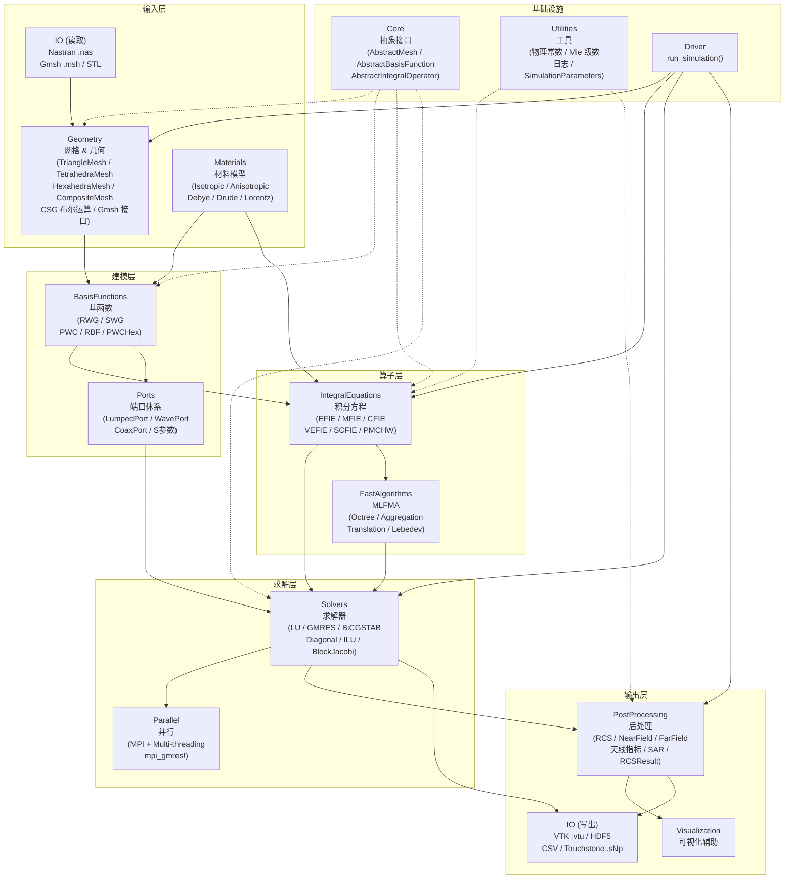

# EMSuite.jl

**EMSuite.jl** 是一个基于 Julia 语言开发的综合性计算电磁学（Computational Electromagnetics, CEM）矩量法（Method of Moments, MoM）框架，从多个 Legacy 代码库（`MoM_Basics`、`MoM_Kernels`、`MoM_AllinOne` 等）重构而来，目标是构建工程级可交付的电磁仿真平台。

**版本**: `0.1.0` | **Julia**: `≥ 1.9` | **状态**: Phase 1–22 全部完成 ✅

---

## 架构总览



---

## 主要特性

### 🔷 积分方程 (Integral Equations)

| 算子 | 适用场景 | 基函数 |
|------|----------|--------|
| EFIE | PEC 表面散射（开/闭体） | RWG |
| MFIE | PEC 闭合体散射 | RWG |
| CFIE | PEC 闭合体（解决内部谐振） | RWG |
| VEFIE | 介质体散射（体积分） | SWG / PWC / RBF / PWCHex |
| SCFIE | 均匀介质体（表面-体积混合） | RWG + SWG/PWC |
| **PMCHW** | **均匀介质体表面积分方程** | **RWG** |

### 🔷 基函数 (Basis Functions)

- **RWG** — Rao-Wilton-Glisson，三角面基函数（表面问题）
- **SWG** — Schaubert-Wilton-Glisson，四面体基函数（体积分）
- **PWC** — Piecewise Constant，脉冲基函数（3 DOF/tet，高效体积分）
- **RBF** — Rao-Billinghast-Farris，六面体旋转基函数
- **PWCHex** — 六面体脉冲基函数

### 🔷 几何引擎 (Geometry)

- **网格类型**: `TriangleMesh`、`TetrahedraMesh`、`HexahedraMesh`、`CompositeMesh`（混合表面+体积）
- **网格 I/O**: Nastran `.nas`（CTRIA3/CTETRA/CHEXA）、Gmsh `.msh`、STL
- **网格生成**: 球、盒体、圆柱、椭球、圆锥、圆环（参数化）
- **Gmsh 接口**: `generate_gmsh_sphere`、`surface_mesh_gmsh`、`tet_mesh_gmsh`（需要 Gmsh.jl）
- **CSG 布尔运算**: `box_solid`、`intersect_solids`、`union_solids`、`subtract_solid`
- **材料绑定**: `BoundMesh`，支持按网格标签绑定材料
- **网格操作**: 平移、缩放、旋转、合并、去重节点、修复朝向

### 🔷 快速算法 (Fast Algorithms)

- **MLFMA** — 多层快速多极子算法，支持 MPI 分布式版本（`MLFMAOperatorMPI`）
- **Lebedev 积分** — 高精度球面数值积分

### 🔷 求解器 (Solvers)

| 求解器 | 类型 | 说明 |
|--------|------|------|
| `LUSolver` | 直接 | LAPACK LU 分解 |
| `GMRESSolver` | 迭代 | 广义最小残差法 |
| `BiCGSTABSolver` | 迭代 | 双共轭梯度稳定法 |
| `DiagonalPreconditioner` | 预条件 | 对角预处理 |
| `ILUPreconditioner` | 预条件 | 不完全 LU 分解 |
| `BlockJacobiPreconditioner` | 预条件 | 按 MLFMA 盒子分块 LU（166× 构建提速） |

### 🔷 并行计算 (Parallel)

- **MPI** (`assemble_impedance_matrix_parallel`、`mpi_gmres!`、`MPIMatrix`)
- **多线程** (`@threads` 行并行，Fss 边界并行，`BlockJacobiPreconditioner`)
- V-EFIE MPI：Allreduce 方案，1→2 进程约 1.24× 加速

### 🔷 端口体系 (Ports)

| 端口类型 | 说明 |
|----------|------|
| `LumpedPort` | 集总端口（集总激励 + 阻抗装配） |
| `WavePort` | 波端口（模式场展开） |
| `CoaxPort` | 同轴端口 |
| `DifferentialPairPort` | 差分对端口 |
| S 参数 | `SParameterData`，Touchstone `.sNp` 读写 |
| 混模转换 | `mixed_mode_transform_matrix`，SDD/SCC/SCD 矩阵 |

### 🔷 材料模型 (Materials)

- **静态**: `Isotropic`（各向同性），`Anisotropic`（张量）
- **色散**: `DebyeModel`（弛豫）、`DrudeModel`（金属等离子体）、`LorentzModel`（谐振）
- **材料库**: `MaterialLibrary`，支持保存/加载内置库

### 🔷 后处理 (PostProcessing)

- **散射**: `radarCrossSection`（单/双站 RCS，支持全基函数类型），`RCSResult`，`rcs_frequency_response`
- **远场**: `farField`，`FarFieldPattern`，`gain`，`gain_db`，`hpbw`，`side_lobe_level`
- **近场**: `calculate_near_field`，`NearFieldGrid`，`NearFieldLine`，`field_cut_plane`
- **天线指标**: `antenna_directivity`，`input_impedance`，`beam_metrics`，`axial_ratio`，`xpd`
- **功率**: `absorbed_power`，`sar`
- **MLFMA 缓存**: `MLFMACache`，`solve_multi_rhs`（多右端项加速）

### 🔷 I/O

| 格式 | 函数 | 说明 |
|------|------|------|
| VTK `.vtu` | `save_vtk`、`save_vtk_multi` | ParaView 可视化 |
| HDF5 | `save_results_hdf5`、`save_result` | 高性能二进制存储 |
| CSV/TXT | `save_RCS_txt`、`save_RCS_csv` | 通用文本结果 |
| Touchstone | `write_touchstone`、`read_touchstone` | RF 网络参数 |

---

## 安装

```julia
# Julia REPL 包管理模式
pkg> add EMSuite
```

或：

```julia
using Pkg
Pkg.add("EMSuite")
```

> **依赖**: Julia ≥ 1.9，可选依赖 `Gmsh.jl`（几何网格生成）、`MPI.jl`（分布式并行）。

---

## 快速开始

### 示例 1：PEC 球散射（EFIE + RWG）

```julia
using EMSuite
using LinearAlgebra

freq   = 300e6          # 频率 300 MHz
radius = 0.5            # 球半径 0.5 m

# 1. 生成球面三角网格
mesh  = generate_sphere_mesh(radius, 12, 24)   # 12 纬度 × 24 经度
basis = RWGBasis(mesh)
println("未知量数 N = ", num_basis(basis))

# 2. 定义算子 + 组装阻抗矩阵
efie = EFIE(freq)
Z    = assemble_impedance_matrix(efie, basis)

# 3. 平面波激励（+x 入射，z 极化）
src  = PlaneWave(freq, π/2, π, [0.0, 0.0, 1.0])
V    = excitation_vector(efie, src, basis)

# 4. 求解
I = Z \ V

# 5. E 面 RCS（与 Mie 级数对比）
θ = collect(range(0.0, π, length=181))
rcs_mom, _, _ = radarCrossSection(θ, [0.0], I, basis, efie.k0, efie.eta0)

mie_rcs = calculate_mie_rcs_pec_sphere(radius, freq, θ)
println("最大误差 (dB): ", maximum(abs.(10log10.(rcs_mom ./ mie_rcs))))
```

### 示例 2：均匀介质球（PMCHW）

```julia
using EMSuite

freq = 300e6;  radius = 0.5;  eps_r = 4.0;  mu_r = 1.0

mesh   = generate_sphere_mesh(radius, 12, 24)
basis  = RWGBasis(mesh)
pmchw  = PMCHW(freq, eps_r, mu_r)
Z      = assemble_impedance_matrix(pmchw, basis)
src    = PlaneWave(freq, 0.0, 0.0, [1.0, 0.0, 0.0])
V      = excitation_vector(pmchw, src, basis)
I      = Z \ V

θ = collect(range(0.0, π, length=181))
mie_E, mie_H, _ = calculate_mie_rcs_dielectric_sphere(radius, freq, θ, eps_r, mu_r)
rcs = radarCrossSection(θ, [0.0], I, basis, pmchw.k0, pmchw.eta0)
println("E 面 RCS 最大误差: ", maximum(abs.(10log10.(rcs[1,:,1] ./ mie_E))), " dB")
```

### 示例 3：Driver 一键仿真

```julia
using EMSuite

result = run_simulation(
    "plate.nas";
    freq=1e9, ie_type=:CFIE, cfie_alpha=0.5,
    solver=:gmres, output_vtk=true
)
println("RCS (θ=0°): ", result.rcs_db[1], " dBsm")
```

---

## 模块结构

```
src/
├── EMSuite.jl               # 主模块，统一导出
├── Core/                    # 抽象接口（AbstractMesh / BasisFunction / Operator / Solver / Source）
├── Utilities/               # 物理常数、SimulationParameters、Mie 级数、日志
├── Geometry/                # 网格 I/O、生成器、CSG 布尔、Gmsh 接口、材料绑定
├── Materials/               # 材料模型（静态 + 色散）、材料库
├── BasisFunctions/          # RWG、SWG、PWC、RBF、PWCHex
├── IntegralEquations/       # EFIE、MFIE、CFIE、VEFIE、SCFIE、PMCHW
│   ├── Kernels.jl           # 自由空间格林函数核
│   ├── Singularities.jl     # 奇异积分解析提取
│   ├── Impedance.jl         # 通用矩阵元素计算
│   └── Excitation.jl        # 激励向量 (PlaneWave / DeltaGap)
├── Solvers/                 # LU、GMRES、BiCGSTAB、预条件器
├── FastAlgorithms/          # MLFMA（Octree、聚合、转移、配置）
├── Parallel/                # MPI 组装 + mpi_gmres!
├── Ports/                   # 端口体系（Lumped/Wave/Coax + S参数）
├── PostProcessing/          # RCS、近/远场、天线指标、功率
├── IO/                      # VTK、HDF5、CSV、Touchstone
├── Visualization/           # 可视化辅助
└── Driver.jl                # run_simulation() 高层驱动
```

---

## 性能基准（4 线程，与 Legacy 对比）

| 场景 | Legacy | EMSuite | 加速比 |
|------|--------|---------|--------|
| Jet EFIE 直接填充 (N=26 424) | 20.70 s | **4.26 s** | **4.9×** |
| Jet CFIE 直接填充 (N=26 424) | 168.29 s | **14.48 s** | **11.6×** |
| V-EFIE SWG (N_tet=7 278) | 46.13 s | **41.30 s** | **1.12×** |
| SCFIE 总装配 (N=15 860) | 66.68 s | **65.67 s** | **1.02×** |

关键优化：SIMD `@fastmath` 内层循环 + 对称性利用（上三角/互易性） + `BlockJacobiPreconditioner`（构建速度 166× 提升）。

---

## 精度验证

PMCHW 与 Mie 级数对比（`radius=0.5 m`，`300 MHz`，`ε_r=4`，`μ_r=1`）：

| 网格 | N（未知量） | E 面均方误差 | E 面最大误差 |
|------|------------|-------------|-------------|
| 8×16 | 224 | ~0.8 dB | ~1.5 dB |
| 12×24 | 528 | ~0.3 dB | ~0.6 dB |
| 18×36 | 1 188 | ~0.1 dB | ~0.2 dB |

随网格加密单调收敛，与 Mie 级数高度吻合。

---

## 结果可视化

`scripts/` 目录提供三个可直接运行的可视化脚本，使用 `Plots.jl`（GR 后端，无 GUI 依赖）输出 PNG 图像。

### 脚本 1：RCS 双站对比 — `plot_rcs_sphere.jl`

```bash
julia --project scripts/plot_rcs_sphere.jl
# 输出: scripts/rcs_sphere_comparison.png
```

生成双图对比：

| 子图 | 内容 |
|------|------|
| 左图 | PEC 球 (EFIE + RWG, N=1 024) vs Mie 解析解，E 面双站 RCS |
| 右图 | 均匀介质球 (PMCHW, ε_r=4) vs Mie 解析解，E 面 & H 面 |

关键代码片段：

```julia
using EMSuite, Plots

# PEC 球 EFIE
mesh = generate_sphere_mesh(0.5, 16, 32);  basis = RWGBasis(mesh)
efie = EFIE(300e6);  Z = assemble_impedance_matrix(efie, basis)
I = Z \ excitation_vector(efie, PlaneWave(300e6, π/2, π, [0,0,1.0]), basis)
rcs, _, _ = radarCrossSection(theta_v, [0.0], I, basis, efie.k0, efie.eta0)
rcs_dB = 10 .* log10.(rcs[1,:,1])

# Mie 参考
mie_db = 10 .* log10.(calculate_mie_rcs_pec_sphere(0.5, 300e6, theta_v))

plot(theta_d, mie_db; label="Mie 解析", ls=:dash)
plot!(theta_d, rcs_dB; label="EFIE (MoM)")
```

---

### 脚本 2：半波偶极子远场方向图 — `plot_dipole_pattern.jl`

```bash
julia --project scripts/plot_dipole_pattern.jl
# 输出: scripts/dipole_pattern.png
```

输出双图：**极坐标方向图**（左）和 **线形对比图**（右），并在终端打印输入阻抗和 S11：

```
Z_in = 78.3 + j44.1 Ω
S11  = -10.2 dB (Z0=50 Ω)
（理论半波偶极子: Z_in ≈ 73 + j42.5 Ω）
最大方向性 = 2.03 dBi   （理论 2.15 dBi）
```

关键代码片段：

```julia
using EMSuite

mesh   = generate_cylinder_mesh(0.001, 0.5, 6, 20)   # 细线偶极子 λ/2 (半径,长,周向段,轴向段)
basis  = RWGBasis(mesh)
efie   = EFIE(300e6)
Z      = assemble_impedance_matrix(efie, basis)

# DeltaGap 馈电: 找轴向中心 RWG 边
feed   = [n for n in 1:num_basis(basis) if abs(basis.functions[n].center[3]) < 0.03]
src    = DeltaGapSource(300e6, feed, 1.0 + 0im)
I      = Z \ excitation_vector(src, basis)

# 输入阻抗 & S11
Z_in   = input_impedance(src, I, basis)
S11_dB = 20log10(abs((Z_in - 50) / (Z_in + 50)))

# 方向图
θs, ϕs = collect(range(1e-3, π-1e-3, 181)), collect(range(0, 2π, 73))
result = antenna_directivity(θs, ϕs, I, basis; P_input=0.5real(sum(I[feed])))
D_dBi  = 10 .* log10.(result.D .+ 1e-30)

# 解析参考: F(θ) = [cos(π/2·cosθ)/sinθ]²
F_theory = [abs(cos(π/2*cos(t))/sin(t))^2 for t in θs]
```

---

### 脚本 3：偶极子 S11 频率扫描 + Smith 圆图 — `plot_s11_dipole_sweep.jl`

```bash
julia --project scripts/plot_s11_dipole_sweep.jl
# 输出: scripts/dipole_s11_sweep.png
```

输出三图（200–500 MHz，31 频率点）：

| 子图 | 内容 |
|------|------|
| 左图 | S11 (dB) vs 频率，标注 -10 dB 带宽和理论谐振点 |
| 中图 | 输入阻抗 R_in、X_in vs 频率（对比理论 R≈73 Ω, X=0） |
| 右图 | Smith 圆图（阻抗轨迹随频率着色） |

关键代码片段：

```julia
using EMSuite

mesh   = generate_cylinder_mesh(0.001, 0.5, 6, 20)   # (半径, 长度, 周向段, 轴向段)
basis  = RWGBasis(mesh)
feed   = [n for n in 1:num_basis(basis) if abs(basis.functions[n].center[3]) < 0.03]

Z_in_sweep = ComplexF64[]
for freq in LinRange(200e6, 500e6, 31)
    set_frequency!(freq)
    Z = assemble_impedance_matrix(EFIE(freq), basis)
    I = Z \ excitation_vector(DeltaGapSource(freq, feed, 1.0+0im), basis)
    push!(Z_in_sweep, input_impedance(DeltaGapSource(freq, feed, 1.0+0im), I, basis))
end

S11_dB = 20 .* log10.(abs.((Z_in_sweep .- 50) ./ (Z_in_sweep .+ 50)))
Γ      = (Z_in_sweep .- 50) ./ (Z_in_sweep .+ 50)   # Smith 圆图坐标
```

---

## 测试

```bash
# 在 EMSuite/ 目录下
julia --project test/runtests.jl
```

测试套件覆盖：几何、基函数、积分方程（所有算子）、求解器、预条件器、后处理、I/O、端口、PMCHW、MLFMA、MPI 并行、Legacy 数值对齐等，共 **449+ 测试用例**，全部 PASS。

---

## 开发路线图

| Phase | 主题 | 状态 |
|-------|------|------|
| 1–7 | 基础架构 → 算法实现 → Legacy 验证对齐 | ✅ |
| 8 | 性能优化（EFIE/CFIE/VEFIE/SCFIE 全面提速） | ✅ |
| 9 | 代码质量与发布准备（覆盖率、文档） | 🔵 进行中 |
| 10 | 全方程精度验证 | ✅ |
| 11–12 | PWC / HexRBF 体基函数 | ✅ |
| 13–15 | MPI 并行架构 | ✅ |
| 16 | 几何与网格基础（CSG、Gmsh 接口） | ✅ |
| 17 | 后处理基础增强 | ✅ |
| 18 | 几何布尔与三维面网格剖分 | ✅ |
| 19 | 体网格剖分与材料管理 | ✅ |
| 20 | 端口体系（HFSS 风格） | ✅ |
| 21 | 丰富后处理与快速算法缓存 | ✅ |
| **22** | **PMCHW 均匀介质体表面积分方程** | ✅ |

---

## 文档

更多详细信息、API 文档和高级用法，请参阅 [在线文档](https://deltaeecs.github.io/EMSuite.jl/dev)。

---

## 许可证

本项目采用 [MIT 许可证](LICENSE)。
