# EMMoMSuite.jl

[](https://github.com/deltaeecs/EMMoMSuite.jl/actions/workflows/CI.yml)
[](https://codecov.io/gh/deltaeecs/EMMoMSuite.jl)

> 中文 | [English](README.en.md)

## 版权与联系方式

本程序版权属于 **北京大学电子学院电磁场与微波技术实验室 夏明耀教授课题组**。有合作需求请联系：

- 夏明耀教授：[myxia@pku.edu.cn](mailto:myxia@pku.edu.cn)
- 贺晓阳：[1801111302@pku.edu.cn](mailto:1801111302@pku.edu.cn)
- 张文炜：[2201111526@stu.pku.edu.cn](mailto:2201111526@stu.pku.edu.cn)

EMMoMSuite.jl 是一个面向工程验证与重构交付的 Julia 计算电磁学框架，核心聚焦矩量法求解链，包括表面积分、体积分、混合积分方程、MLFMA、MPI 并行、端口建模、后处理与发布验证流程。

当前仓库状态已经不再是“单一求解器包”这么简单，而是分成两条清晰链路：

- 主包运行时链：`src/` 下的几何、基函数、积分方程、求解器、后处理、I/O 与并行能力。
- benchmark / release 链：`benchmark/` 下的精度基准、性能基线、统一报告、发布工作流与图表资产生成。

## 当前状态

| 项目 | 状态 |
|------|------|
| Julia 版本 | `1.10+` |
| 主包入口 | `using EMMoMSuite` |
| 发布工作流 | `benchmark/run_release_workflow.jl` |
| 统一报告入口 | `benchmark/run_release_validation_report.jl` |
| 图表环境 | `benchmark/Project.toml` 隔离 `Plots` |
| 最近验证 run | `test_results/runs/20260311_084333/` |
| 当前发布结论 | 18/20 精度曲线阈值内，2 项已登记 known exception，无新增 blocker |

## 安装

最新发布版本：`v0.1.0`（已注册到 Julia General Registry）。

```julia
using Pkg
Pkg.add("EMMoMSuite")
```

本地开发 / 修改源码时使用 dev 模式：

```julia
using Pkg
Pkg.develop(path = "本仓库路径")
```

旧包名 `EMSuite.jl` 已废弃，请勿再使用 `Pkg.add("EMSuite")`。

## 架构总览

下面这张图按“运行时求解链 + 基础设施 + 发布验证链”重新组织，避免旧版 README 中箭头过密、主题混乱的问题。

```mermaid
%%{init: {'theme': 'base', 'themeVariables': { 'background': '#fbfbf7', 'primaryColor': '#e8f1df', 'primaryTextColor': '#243224', 'primaryBorderColor': '#6d8a63', 'lineColor': '#6c6c6c', 'secondaryColor': '#e7edf7', 'secondaryBorderColor': '#6e86a6', 'tertiaryColor': '#f6ead7', 'tertiaryBorderColor': '#b48a4d', 'fontFamily': 'Microsoft YaHei, Segoe UI, sans-serif'}}}%%
flowchart LR
    IO["输入与几何<br/>Nastran / STL / Gmsh<br/>TriangleMesh / TetrahedraMesh / HexahedraMesh"]
    MAT["材料与边界<br/>Isotropic / Anisotropic<br/>Debye / Drude / Lorentz"]
    BF["基函数与端口<br/>RWG / SWG / PWC / RBF<br/>LumpedPort / WavePort / CoaxPort"]
    IE["积分方程层<br/>EFIE / MFIE / CFIE<br/>VEFIE / SCFIE / PMCHW / NMuller"]
    FA["快速算法层<br/>MLFMA / Lebedev<br/>Near-field / Far-field split"]
    SLV["求解层<br/>LU / GMRES / BiCGSTAB<br/>Diagonal / ILU / BlockJacobi"]
    PP["后处理层<br/>RCS / NearField / FarField<br/>Antenna metrics / SAR"]
    OUT["结果输出<br/>VTK / HDF5 / CSV / Touchstone<br/>Release report assets"]
    PAR["并行能力<br/>Threads / MPI / MPIMatrix<br/>mpi_gmres / parallel assembly"]
    CORE["基础设施<br/>Core abstractions / Utilities<br/>Driver / Simulation config"]
    REL["验证与发布链<br/>benchmark/support/release_support.jl<br/>run_release_workflow.jl / report pipeline"]

    IO --> BF
    MAT --> BF
    MAT --> IE
    BF --> IE
    IE --> FA
    IE --> SLV
    FA --> SLV
    SLV --> PP
    PP --> OUT
    SLV --> OUT
    PAR --> SLV
    CORE -.支持.-> IO
    CORE -.支持.-> IE
    CORE -.支持.-> SLV
    CORE -.支持.-> PP
    REL -.消费 accuracy / performance artifacts.-> OUT

    classDef runtime fill:#e8f1df,stroke:#6d8a63,color:#243224,stroke-width:1.2px;
    classDef infra fill:#e7edf7,stroke:#6e86a6,color:#24324a,stroke-width:1.2px;
    classDef release fill:#f6ead7,stroke:#b48a4d,color:#4d3920,stroke-width:1.2px;

    class IO,MAT,BF,IE,FA,SLV,PP,OUT,PAR runtime;
    class CORE infra;
    class REL release;
```



## 核心能力

### 积分方程

| 类别 | 主要算子 | 典型场景 |
|------|----------|----------|
| 表面散射 | `EFIE` `MFIE` `CFIE` | PEC 开闭体散射与辐射 |
| 体积分 | `VEFIE` | 均匀介质体、电介质板、体网格模型 |
| 混合表体 | `SCFIE` | 表面金属 + 介质体混合问题 |
| 介质表面积分 | `PMCHW` `NMuller` | 均匀介质表面等效电流问题 |

### 基函数与几何

- 表面基函数：`RWG`
- 体基函数：`SWG` `PWC` `RBF` `PWCHex`
- 网格类型：`TriangleMesh` `TetrahedraMesh` `HexahedraMesh` `CompositeMesh`
- 网格输入：Nastran `.nas`、Gmsh `.msh`、STL
- 几何操作：平移、缩放、旋转、合并、去重、朝向修复、CSG 布尔、Gmsh 建模接口

### 求解与并行

- 直接法：`LUSolver`
- 迭代法：`GMRESSolver` `BiCGSTABSolver`
- 预条件器：`DiagonalPreconditioner` `ILUPreconditioner` `BlockJacobiPreconditioner`
- 快速算法：`MLFMA` `MLFMAOperatorMPI`
- 并行能力：线程并行、MPI 组装、`mpi_gmres!`、`MPIMatrix`

### 后处理与端口

- 散射与辐射：`radarCrossSection` `farField` `calculate_near_field`
- 天线指标：`antenna_directivity` `input_impedance` `beam_metrics` `gain_db` `axial_ratio`
- 端口体系：`LumpedPort` `WavePort` `CoaxPort` `DifferentialPairPort`
- 数据输出：VTK、HDF5、CSV、Touchstone

## 快速开始

README 中原来的安装和脚本说明已经过时。当前最稳妥的方式是把本仓库当作本地工程使用，并分别实例化主环境和 benchmark 环境。

### 1. 主环境

```julia
using Pkg
Pkg.activate(".")
Pkg.instantiate()
```

### 2. benchmark / report 环境

```julia
using Pkg
Pkg.activate("benchmark")
Pkg.instantiate()
```

### 3. 主包装载检查

```bash
julia --project=. -e "using Pkg; Pkg.resolve(); using EMMoMSuite"
```

### 4. 统一发布链 smoke run

```bash
julia --project=. benchmark/run_release_workflow.jl benchmark/configs/release_quick.toml
```

### 5. 单独生成统一报告

```bash
julia --project=. benchmark/run_release_validation_report.jl
julia --project=benchmark benchmark/run_release_validation_report.jl
```

脚本会在必要时自动切换到 benchmark 环境，因此从根环境直接调用也可以；显式使用 `--project=benchmark` 仍然是最直接的方式。

## 使用指引

### 低层 API：直接组装与求解

下面是当前仍有效的最小 PEC 球散射示例，接口与仓库内 benchmark / test 使用方式保持一致。

```julia
using EMMoMSuite
using LinearAlgebra

freq = 300e6
set_frequency!(freq)

mesh = generate_sphere_mesh(0.5, 12, 24)
basis = RWGBasis(mesh)
op = EFIE(freq)
src = PlaneWave(freq, π / 2, π, [0.0, 0.0, 1.0])

Z = assemble_impedance_matrix(op, basis)
V = excitation_vector(op, src, basis)
I = Z \ V

theta = collect(range(-π, π, length = 721))
phis = [0.0, π / 2]
_, _, rcs = radarCrossSection(theta, phis, I, basis)
```

### 发布链：精度 / 性能 / 报告一体化

如果你的目标不是单个算子求解，而是复现项目当前的回归验证链，建议优先走下面两个入口。

```bash
# 生成统一 run 工件、manifest、run_status、artifact_index
julia --project=. benchmark/run_release_workflow.jl benchmark/configs/release_quick.toml

# 仅重建统一报告与图表资产
julia --project=. benchmark/run_release_validation_report.jl
julia --project=benchmark benchmark/run_release_validation_report.jl
```

这些命令会更新或复用以下目录：

- `test_results/runs/<run_id>/`
- `test_results/reports/`
- `test_results/accuracy/`

## 模块结构

### 主包运行时结构

```text
src/
├── EMMoMSuite.jl
├── Core/                 # 抽象接口、配置与基础类型
├── Utilities/            # 常数、日志、轻量支持工具、Mie 参考
├── Geometry/             # 网格 I/O、生成器、CSG、Gmsh 接口、标签传播
├── Materials/            # 各向同性/各向异性/色散材料与材料库
├── BasisFunctions/       # RWG / SWG / PWC / RBF / PWCHex
├── IntegralEquations/    # EFIE / MFIE / CFIE / VEFIE / SCFIE / PMCHW / NMuller
├── FastAlgorithms/       # MLFMA、Lebedev、PMCHW-MLFMA 相关组件
├── Solvers/              # LU / GMRES / BiCGSTAB / 预条件器
├── Parallel/             # MPI 组装、mpi_gmres、MPIArray 基础设施
├── Ports/                # Lumped / Wave / Coax / DifferentialPair / S 参数
├── PostProcessing/       # RCS、近远场、增益、SAR、多右端缓存
├── IO/                   # VTK / HDF5 / CSV / Touchstone
├── Accuracy/             # FEKO / Mie 对比与精度指标工具
└── Driver.jl             # run_simulation 高层入口
```

### benchmark / release 结构

```text
benchmark/
├── configs/              # release profile、阈值、图表样式、known exceptions
├── support/              # release_support.jl，报告链共用轻量支撑
├── reporting/            # collector / plotting / writer 拆层
├── accuracy/             # F / P / B 系列精度基准入口
├── performance_baseline.jl
├── run_release_workflow.jl
└── run_release_validation_report.jl
```

## 性能基准

下表来自当前稳定报告（由 `benchmark/run_release_workflow.jl` 生成，输出到 `test_results/reports/PERFORMANCE_BASELINE.csv`）。这些数字是当前验证机器上的基线，不应直接当作跨机器承诺值。

| 用例 | 方程 | 求解策略 | N | Assembly / Setup (s) | Solve (s) | Total (s) |
|------|------|----------|---|----------------------|-----------|-----------|
| Plate EFIE Direct | EFIE | LU | 2640 | 0.85 | 0.73 | 3.14 |
| Jet EFIE Direct | EFIE | LU | 14559 | 3.12 | 16.35 | 20.01 |
| Jet CFIE Direct | CFIE | LU | 14559 | 10.28 | 15.89 | 26.71 |
| Jet EFIE MLFMA | EFIE | MLFMA + GMRES | 14559 | 25.22 | 8.53 | 68.54 |
| Sphere CFIE MLFMA | CFIE | MLFMA + GMRES | 26424 | 109.79 | 10.29 | 267.16 |
| Plate VEFIE Direct | VEFIE | LU | 15828 | 105.68 | 20.71 | 127.73 |
| PlateMetal SCFIE Direct | SCFIE | LU | 15860 | 105.43 | 20.29 | 126.01 |

如果你只想重跑性能基线：

```bash
julia -t auto --project=. benchmark/performance_baseline.jl
```

## 精度验证

当前统一报告的执行摘要来自 release 流程生成的 `test_results/reports/RELEASE_VALIDATION_REPORT.md`（入口：`benchmark/run_release_validation_report.jl`）。截至最近一次验证：

- Accuracy curves within threshold: `18 / 20`
- Known exceptions accepted: `2`
- Accuracy blockers above threshold: `0`
- 当前唯一登记的 release known exception：`F2_CFIE_Jet_Direct`

代表性精度结果如下：

| 曲线 | 参考 | RMSE (dB) | MaxErr (dB) | 状态 |
|------|------|-----------|-------------|------|
| F1_SEFIE_Jet_Direct_phi0_vs_Feko | FEKO | 0.356 | 6.284 | PASS |
| F5_CFIE_Sphere_Direct_phi0_vs_Mie | Mie | 0.051 | 0.320 | PASS |
| F6_CFIE_Sphere_MLFMA_phi0_vs_Mie | Mie | 0.051 | 0.298 | PASS |
| F7_VEFIE_Plate_Direct_phi0_vs_Feko | FEKO | 0.097 | 0.469 | PASS |
| P1_PMCHW_Sphere_Direct_phi0_vs_Mie | Mie | 0.099 | 0.496 | PASS |
| P3_PMCHW_LossySphere_Direct_phi0_vs_Mie | Mie | 0.009 | 0.028 | PASS |
| X1_SEFIE_Sphere_Direct_phi0_vs_Mie | Mie | 0.011 | 0.087 | PASS |
| F2_CFIE_Jet_Direct_phi0_vs_Feko | FEKO | 5.089 | 30.564 | KNOWN_EXCEPTION |

known exception 的具体登记位置在 [benchmark/configs/known_exceptions.toml](benchmark/configs/known_exceptions.toml)。

## 结果可视化

旧 README 中引用的 `scripts/plot_*.jl` 已经不再是当前主路径，现行可视化结果由统一报告自动生成。

### 报告资产输出位置

- 统一报告：`test_results/reports/RELEASE_VALIDATION_REPORT.md`
- 精度曲线图：`test_results/reports/assets/accuracy/`
- 极坐标图：`test_results/reports/assets/accuracy_polar/`
- 性能图：`test_results/reports/assets/performance/`
- run 级别归档：`test_results/runs/<run_id>/report/` 与 `.../plots/`

### 结果可视化类型

- 笛卡尔远场对比图
- 极坐标远场图
- 性能总耗时图
- 性能拆分图
- `run_status.csv` 与 `artifact_index.csv` 配套结构化产物

### 求解结果外部可视化

运行时求解链仍支持将场结果导出给第三方工具查看：

- `save_vtk` `save_vtk_multi`：ParaView / VTK 工作流
- `save_results_hdf5` `save_result`：二进制归档
- `save_RCS_csv` `save_RCS_txt`：文本结果共享
- `write_touchstone`：端口网络参数交换

## 测试与回归

### 主测试集

```bash
julia --project=. test/runtests.jl
```

主测试入口覆盖材料、几何、基函数、积分方程、求解器、MLFMA、MPI、端口、后处理、精度度量、发布工作流与 Legacy 对齐等核心模块。

### 常用定向验证

```bash
julia --project=. test/test_pmchw.jl
julia --project=. test/test_release_workflow.jl
julia --project=. test/test_benchmark_report_data.jl
```

### 分批运行入口

- `test/runtests_batch1.jl` 到 `test/runtests_batch5.jl`
- `test/runtests_light_cov.jl`

## 常用命令速查

```bash
# 载入主包
julia --project=. -e "using EMMoMSuite"

### 改名说明

- 本仓库当前主包名为 `EMMoMSuite.jl`
- 旧包名 `EMSuite.jl` 已废弃，仓库内现行命令与示例均以 `EMMoMSuite` 为准

# 全量主测试
julia --project=. test/runtests.jl

# 性能基线
julia -t auto --project=. benchmark/performance_baseline.jl

# release quick profile
julia --project=. benchmark/run_release_workflow.jl benchmark/configs/release_quick.toml

# 统一报告
julia --project=benchmark benchmark/run_release_validation_report.jl

# 生成文档
julia --project=docs docs/make.jl
```

## 旧包迁移说明（Legacy packages）

本仓库是原分散 MoM 包体系的整合与延续（`EMMoMSuite.jl` 为最新版本）。以下旧仓库已归档（read-only），
不再单独维护，对应功能已并入本包：

| 旧仓库 | 状态 | 并入模块 |
|--------|------|----------|
| `MoM_Basics.jl` | 已归档 | `Geometry` / `BasisFunctions` / `CoreModule`（Sources、Parameters） |
| `MoM_Kernels.jl` | 已归档 | `IntegralEquations` / `FastAlgorithms.MLFMA` / `Solvers` / `PostProcessing` |
| `MoM_AllinOne.jl` | 已归档 | `Driver` / 统一求解链 |
| `MoM_MPI.jl` | 已归档 | `Parallel`（MPI） |
| `MoM_Lebedev.jl` | 已归档 | `FastAlgorithms.Lebedev` |
| `MoM_Visualizing.jl` | 已归档 | benchmark / scripts 可视化工具链 |
| `MPIArray4MoMs.jl` | 已归档 | `Parallel.MPI.MPIArray` |

新代码统一使用 `using EMMoMSuite`。归档仓库的网格与 FEKO 基线数据已收编到本仓库
`deps/fixtures/`，测试与 benchmark 不再依赖旧仓库路径。

## 许可证

本项目采用 [GNU GPL v3 许可证](LICENSE)（GPL-3.0-only），与原 MoM 系列包（`MoM_Basics` / `MoM_Kernels` / `MoM_AllinOne` / `MoM_MPI` / `MoM_Lebedev` / `MoM_Visualizing`）保持一致。

- 本软件免费提供给学术研究人员使用；
- GPL v3 为 copyleft 协议：任何基于本软件进一步开发的程序同样需要开源；
- 不推荐商业环境使用；如有商业或合作需求，请联系作者确认适用条件。
