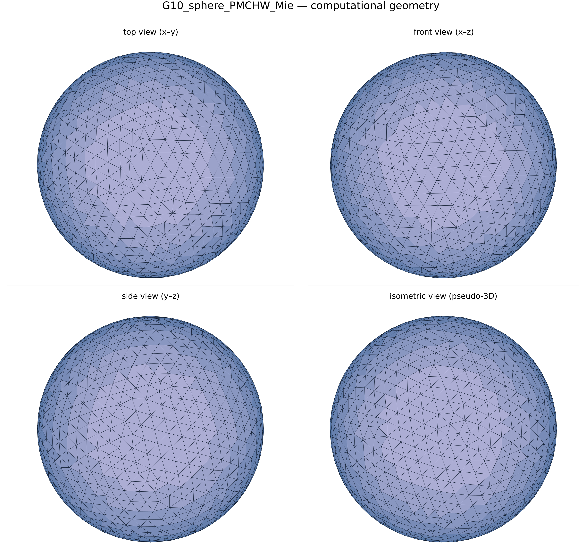
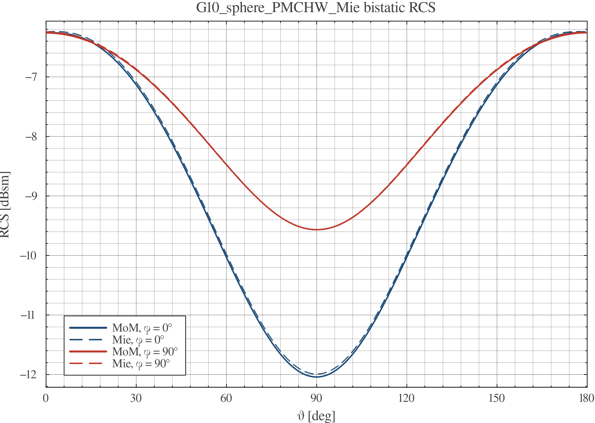
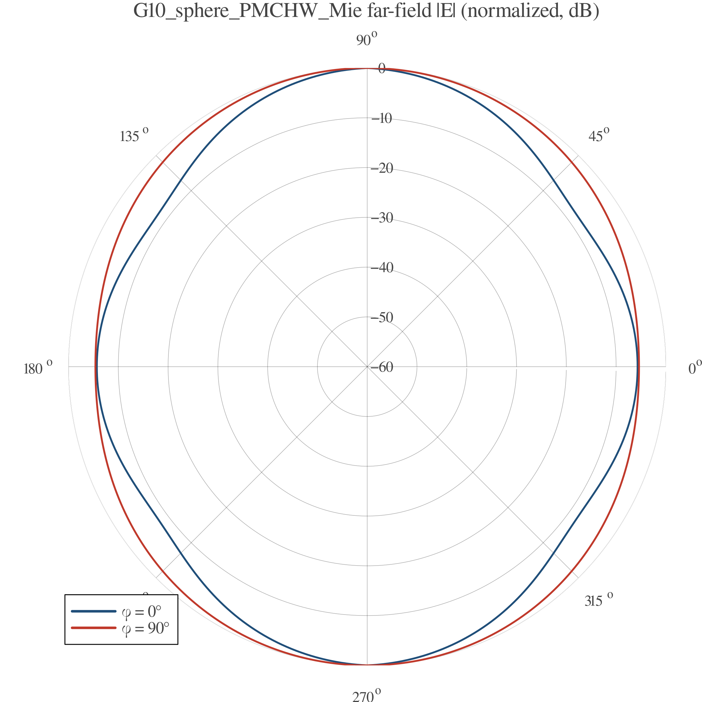

# EMMoMSuite Validation Report — `G10_sphere_PMCHW_Mie`

| | |
|---|---|
| solver | EMMoMSuite v0.3.1 (Julia 1.12.3) |
| generated | 2026-10-10 09:42:47 |
| pipeline | geometry → gmsh mesh → MoM solve → RCS / far-field → this report |

## 1 · Geometry

Boundary discretization: **1784 triangles**, 894 nodes; geometry source `cases/geo/sphere_r0p15.geo` (gmsh/OpenCASCADE).

## 2 · Simulation Configuration

| item | value |
|---|---|
| geometry | `cases/geo/sphere_r0p15.geo` |
| mesh size | 0.02 m |
| mesh dim | 2 (surface triangulation) |
| frequency | 600.0 MHz (λ = 0.5 m) |
| formulation | PMCHW |
| interfaces (n̂ = mesh triangle normal) | plus side (n̂) | minus side |
|---|---|---|
| `body` (closed) | Dielectric(εᵣ=1.0 + 0.0im, μᵣ=1.0 + 0.0im) | Dielectric(εᵣ=4.0 + 0.0im, μᵣ=1.0 + 0.0im) |
| incidence | θᵢ = 90.0°, φᵢ = 180.0°, pol = [0.0, 0.0, 1.0] |
| observation | θ ∈ [0°, 180°] (181 samples), φ cuts = 0.0°, 90.0° |
| reference | analytic Mie series, dielectric sphere r = 0.15 m |

## 3 · Performance & Efficiency

| triangles/tets | nodes | unknowns | t_mesh | t_assemble | t_solve | t_RCS | t_plots |
|---|---|---|---|---|---|---|---|
| 1784 | 894 | 2676 | 180.2 s | 9.7 s | 1.5 s | 1.4 s | 0.5 s |

| total time | assembly rate | LU throughput |
|---|---|---|
| 193.2 s | 0.000736 × 10⁹ interactions/s | 8.6 Gflop/s |

*Assembly rate counts N² impedance-matrix interactions; LU throughput uses the dense (2/3)·N³ flop model (single node, default BLAS threads).*
Machine-readable: `perf.csv`, `rcs.csv`.

## 4 · Results & Comparison

Bistatic RCS — MoM vs analytic reference:

Normalized far-field |E| pattern:

| phi cut | RMSE vs Mie [dB] | verdict |
|---|---|---|
| 0.0° | 0.044 | pass |
| 90.0° | 0.013 | pass |

## 5 · Key Conclusions

- Electric resolution: mesh size 0.02 m = 0.04 λ at f = 600.0 MHz (90.0°, 180.0° plane-wave incidence).
- Accuracy: worst-cut RMSE vs analytic Mie reference = 0.044 dB over 2 cuts → **PASS** against the 0.5 dB acceptance line.
- Throughput: impedance assembly 0.000736 G-interactions/s, dense LU 8.6 Gflop/s at N = 2676 unknowns.
- Dominant cost: gmsh meshing — 180.2 s (93.0% of the 193.2 s total).
- Bistatic RCS dynamic range over the observed cuts: -12.0 … -6.3 dBsm.

## Artifacts

- geometry: `geometry_views.png` · RCS data: `rcs.csv` · performance: `perf.csv`
- plots: `rcs_cuts.png`, `farfield_polar.png`
