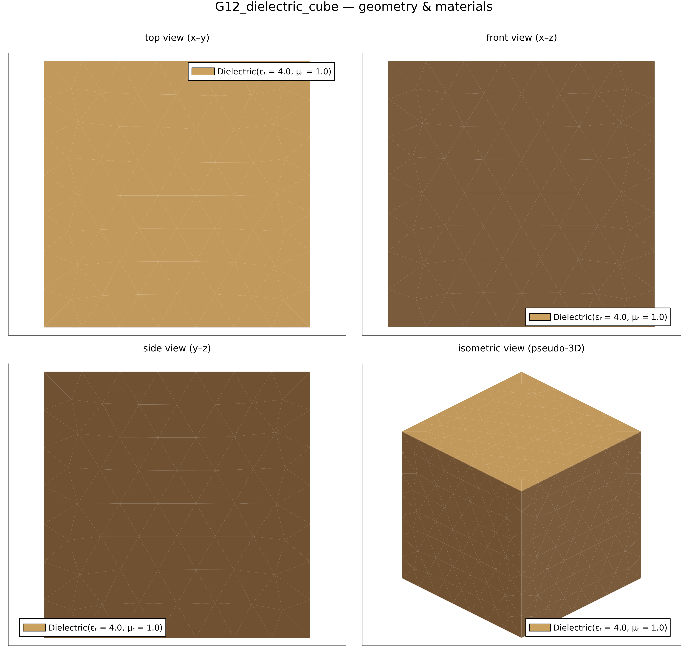
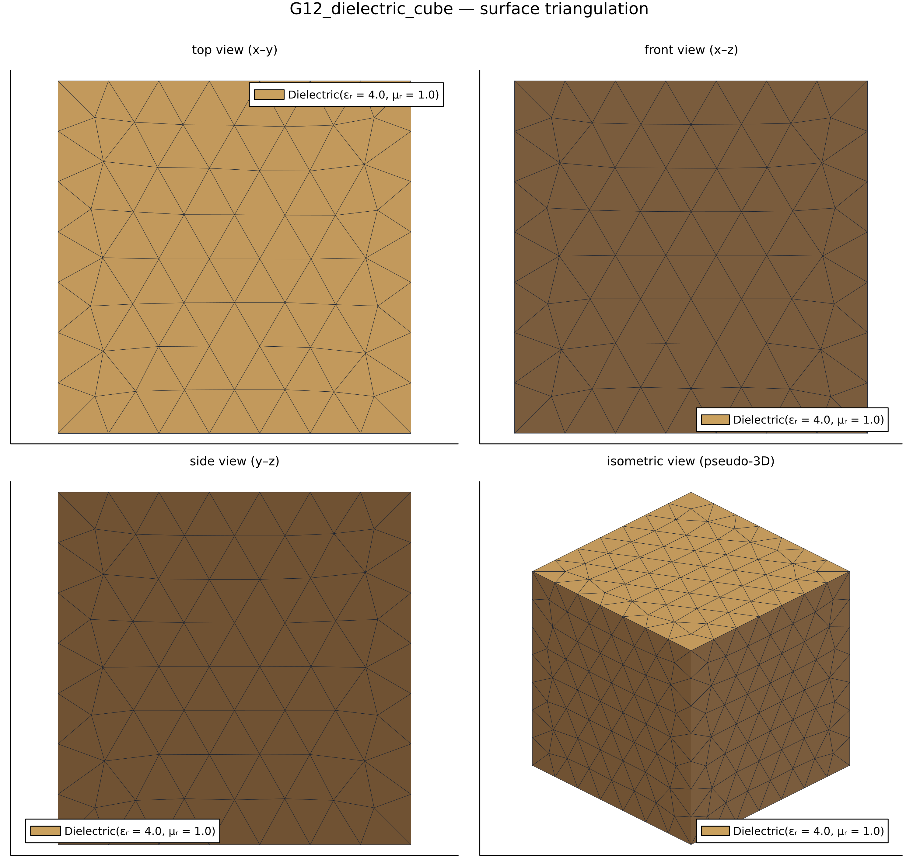
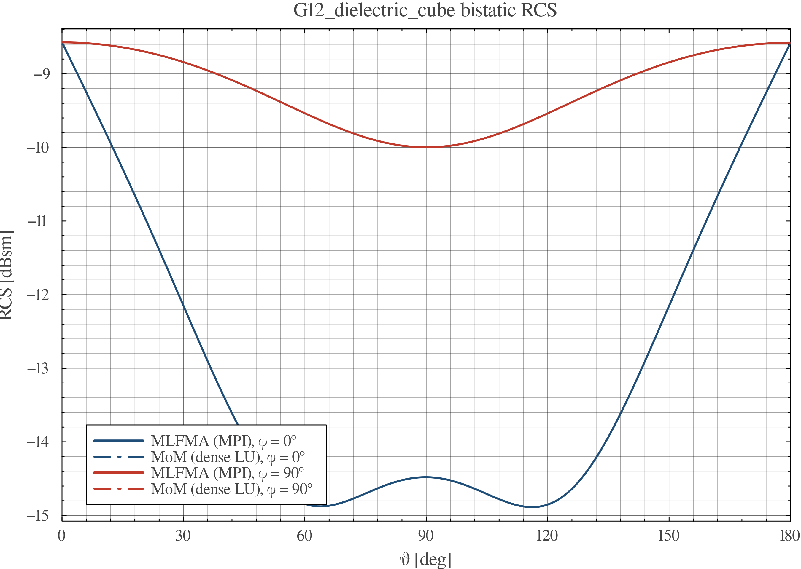
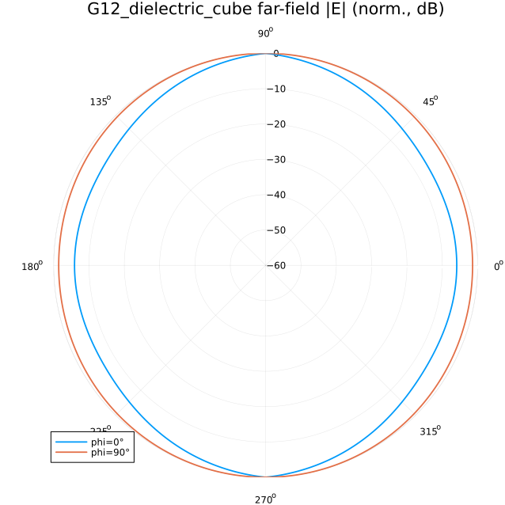

# EMMoMSuite Validation Report — `G12_dielectric_cube`

| | |
|---|---|
| solver | EMMoMSuite v0.3.1 (Julia 1.12.3) |
| generated | 2026-10-10 11:58:53 |
| pipeline | geometry → gmsh mesh → MoM solve → RCS / far-field → this report |

## 1 · Geometry & Mesh

Boundary discretization: **1602 boundary triangles (of 1602 tetrahedra)**, 463 nodes; geometry source `cases/geo/cube_r0p1.geo` (gmsh/OpenCASCADE).

## 2 · Simulation Configuration

| item | value |
|---|---|
| geometry | `cases/geo/cube_r0p1.geo` |
| mesh size | 0.03 m |
| mesh dim | 3 (tetrahedral volume mesh) |
| frequency | 600.0 MHz (λ = 0.5 m) |
| formulation | VEFIE (SWG volume discretization) |
| regions (Physical Volume) | material | tag |
|---|---|---|
| `body` | Dielectric(εᵣ = 4.0, μᵣ = 1.0) | 1 |
| incidence | θᵢ = 90.0°, φᵢ = 180.0°, pol = [0.0, 0.0, 1.0] |
| observation | θ ∈ [0°, 180°] (181 samples), φ cuts = 0.0°, 90.0° |

## 3 · Performance & Efficiency

| triangles/tets | nodes | unknowns | t_mesh | t_assemble | t_solve | t_RCS | t_plots |
|---|---|---|---|---|---|---|---|
| 1602 | 463 | 3558 | 157.1 s | 21.5 s | 0.4 s | 1.2 s | 1.1 s |

| total time | assembly rate | LU throughput |
|---|---|---|
| 181.2 s | 0.000589 × 10⁹ interactions/s | 76.6 Gflop/s |

*Assembly rate counts N² impedance-matrix interactions; LU throughput uses the dense (2/3)·N³ flop model (single node, default BLAS threads).*
Machine-readable: `perf.csv`, `rcs.csv`.

## 4 · Results & Comparison

Bistatic RCS — dense MoM solution:

Normalized far-field |E| pattern:

Surface-current magnitude |J| (dB, normalized to peak):

No analytic reference for this geometry.
Verification method: mesh convergence — compare the RCS cuts
(`rcs.csv` / `rcs_cuts.png`) against the refined twin case on the
same observation grid; agreement within ~1 dB indicates a
mesh-converged solution.

## 5 · Key Conclusions

- Electric resolution: mesh size 0.03 m = 0.06 λ at f = 600.0 MHz (90.0°, 180.0° plane-wave incidence).
- No analytic reference exists for this geometry; verification is by mesh convergence against the refined twin case (see §4).
- Throughput: impedance assembly 0.000589 G-interactions/s, dense LU 76.6 Gflop/s at N = 3558 unknowns.
- Dominant cost: gmsh meshing — 157.1 s (87.0% of the 181.2 s total).
- Bistatic RCS dynamic range over the observed cuts: -14.9 … -8.6 dBsm.

## Artifacts

- geometry: `geometry_views.png` · RCS data: `rcs.csv` · performance: `perf.csv`
- plots: `rcs_cuts.png`, `farfield_polar.png`
