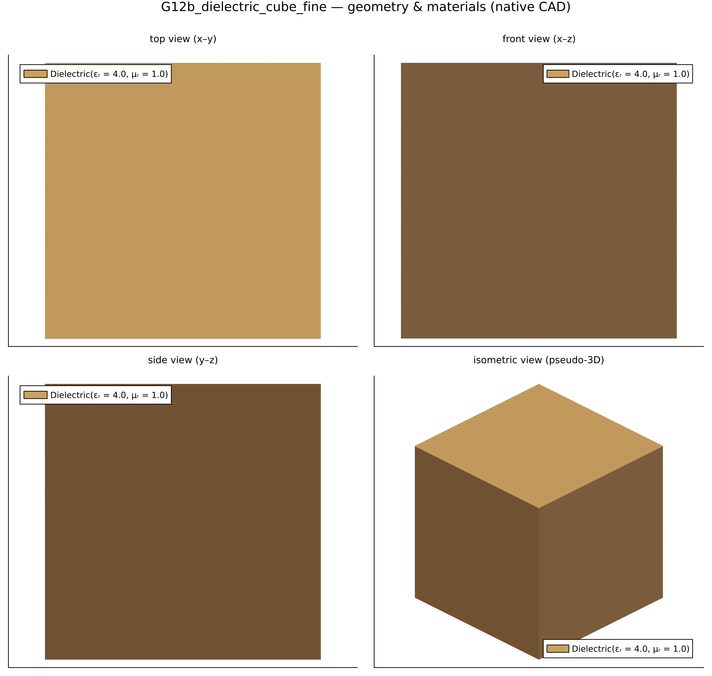
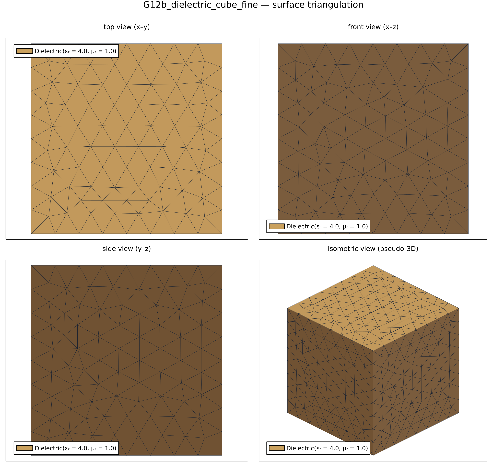
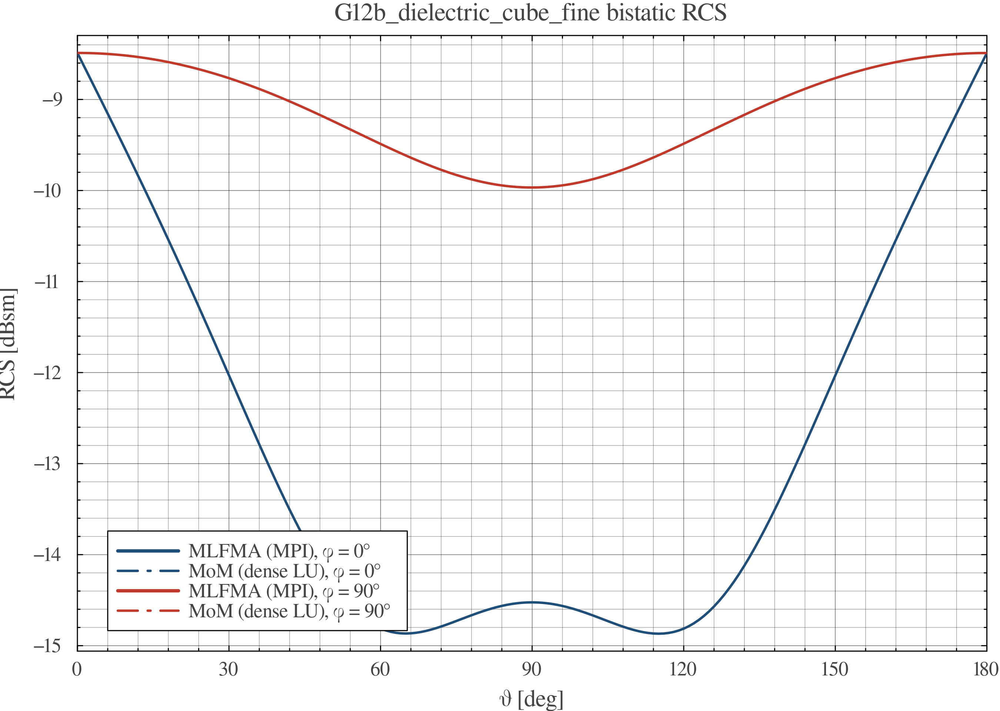
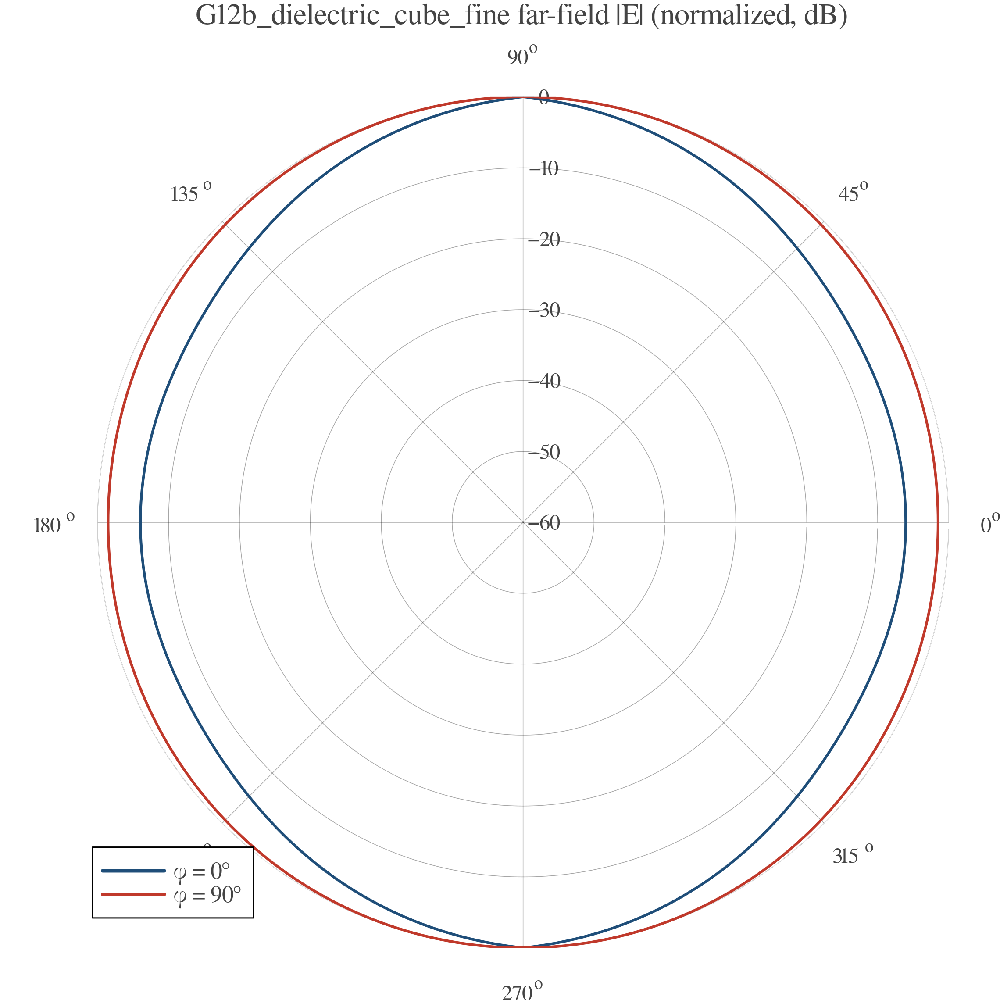

# EMMoMSuite Validation Report — `G12b_dielectric_cube_fine`

| | |
|---|---|
| solver | EMMoMSuite v0.3.1 (Julia 1.12.3) |
| generated | 2026-10-10 19:47:13 |
| pipeline | geometry → gmsh mesh → MoM solve → RCS / far-field → this report |
| parallel | MPI distributed GMRES (P = 2 ranks, SAI precond, leaf = 0.1 m, rel-res = 2.1e-14) |

## 1 · Geometry & Mesh

Boundary discretization: **2725 boundary triangles (of 2725 tetrahedra)**, 711 nodes; geometry source `cases/geo/cube_r0p1.geo` (gmsh/OpenCASCADE).

## 2 · Simulation Configuration

| item | value |
|---|---|
| geometry | `cases/geo/cube_r0p1.geo` |
| mesh size | 0.025 m |
| mesh dim | 3 (tetrahedral volume mesh) |
| frequency | 600.0 MHz (λ = 0.5 m) |
| formulation | VEFIE (SWG volume discretization) |
| regions (Physical Volume) | material | tag |
|---|---|---|
| `body` | Dielectric(εᵣ = 4.0, μᵣ = 1.0) | 1 |
| incidence | θᵢ = 90.0°, φᵢ = 180.0°, pol = [0.0, 0.0, 1.0] |
| observation | θ ∈ [0°, 180°] (181 samples), φ cuts = 0.0°, 90.0° |

## 3 · Performance & Efficiency

| triangles/tets | nodes | unknowns | t_mesh | t_assemble | t_solve | t_RCS | t_plots |
|---|---|---|---|---|---|---|---|
| 2725 | 711 | 5939 | 161.3 s | 124.9 s | 0.5 s | 1.9 s | 1.3 s |

| total time | assembly rate | LU throughput |
|---|---|---|
| 289.9 s | 0.000282 × 10⁹ interactions/s | 306.9 Gflop/s |

*Assembly rate counts N² impedance-matrix interactions; LU throughput uses the dense (2/3)·N³ flop model (single node, default BLAS threads).*
Machine-readable: `perf.csv`, `rcs.csv`.

## 4 · Results & Comparison

Bistatic RCS — dense MoM solution:

Normalized far-field |E| pattern:

Surface-current magnitude |J| (dB, normalized to peak):

Cross-method validation — MLFMA distributed GMRES (MPI distributed GMRES (P = 2 ranks, SAI precond, leaf = 0.1 m, rel-res = 2.1e-14); leaf = λ/2, restart = 200, tol = 10⁻⁶) vs dense MoM (LU) reference, LU total 53.2 s:

| phi cut | RMSE MoM vs MLFMA [dB] | verdict |
|---|---|---|
| 0.0° | 0.000 | pass |
| 90.0° | 0.000 | pass |

## 5 · Key Conclusions

- Electric resolution: mesh size 0.025 m = 0.05 λ at f = 600.0 MHz (90.0°, 180.0° plane-wave incidence).
- Accuracy: no analytic reference exists for this geometry; dense MoM (LU) and fast MLFMA (GMRES) solutions agree to 0.0 dB worst-cut RMSE → **PASS** against the 1 dB cross-method acceptance line.
- Throughput: impedance assembly 0.000282 G-interactions/s, dense LU 306.9 Gflop/s at N = 5939 unknowns.
- Dominant cost: gmsh meshing — 161.3 s (56.0% of the 289.9 s total).
- Bistatic RCS dynamic range over the observed cuts: -14.9 … -8.5 dBsm.

## Artifacts

- geometry: `geometry_views.png` · RCS data: `rcs.csv` · performance: `perf.csv`
- plots: `rcs_cuts.png`, `farfield_polar.png`
