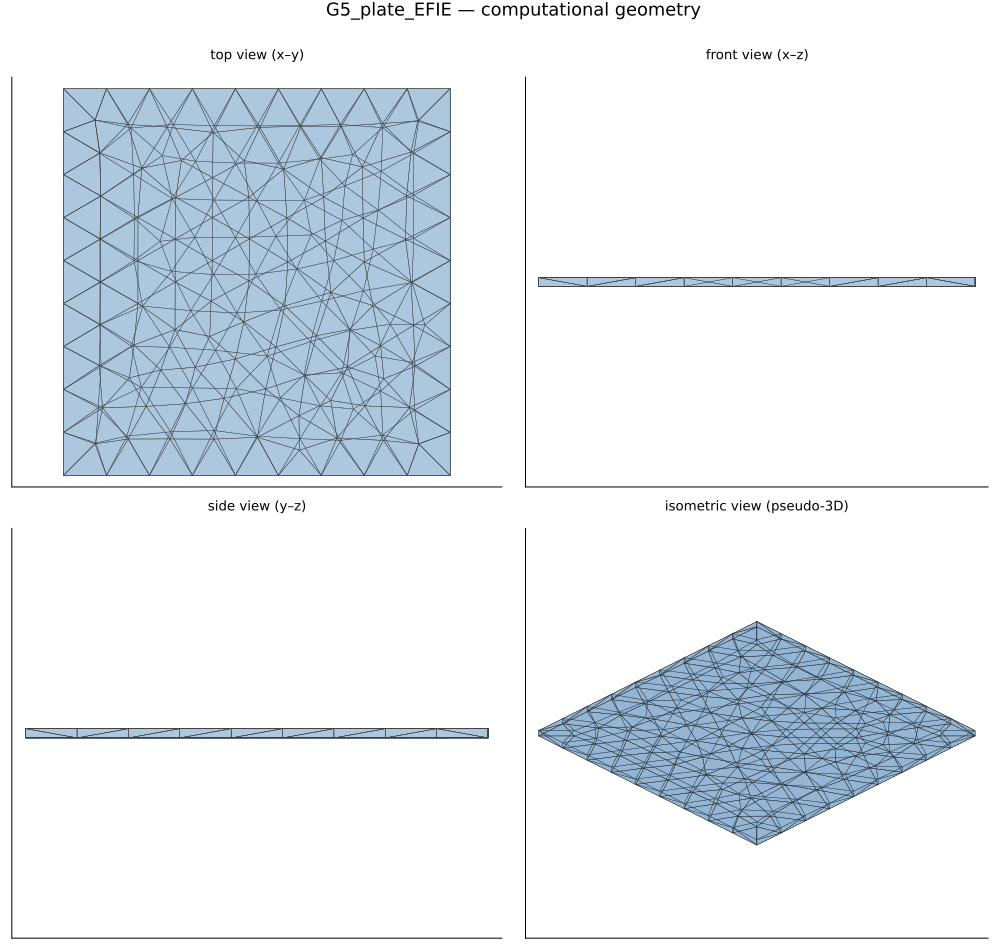
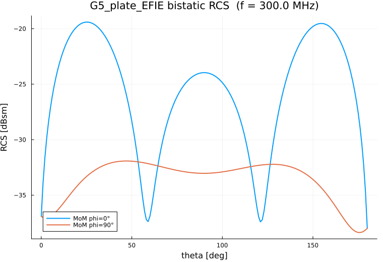
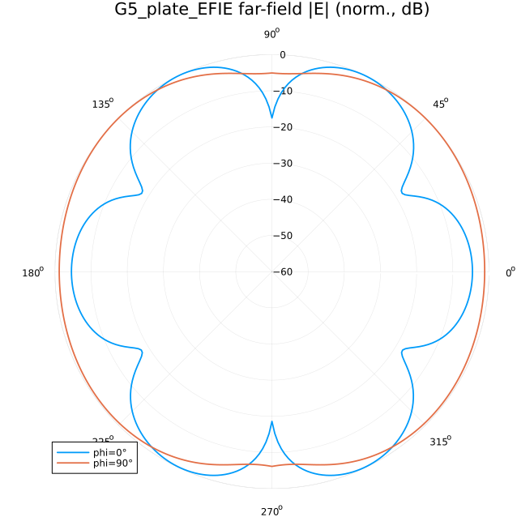

# EMMoMSuite Validation Report — `G5_plate_EFIE`

| | |
|---|---|
| solver | EMMoMSuite v0.3.0 (Julia 1.12.3) |
| generated | 2026-10-09 23:12:38 |
| pipeline | geometry → gmsh mesh → MoM solve → RCS / far-field → this report |

## 1 · Geometry

Boundary discretization: **470 triangles**, 237 nodes; geometry source `cases/geo/plate.geo` (gmsh/OpenCASCADE).

## 2 · Simulation Configuration

| item | value |
|---|---|
| geometry | `cases/geo/plate.geo` |
| mesh size | 0.12 m |
| mesh dim | 2 (surface triangulation) |
| frequency | 300.0 MHz (λ = 1.0 m) |
| formulation | EFIE |
| interfaces (n̂ = mesh triangle normal) | plus side (n̂) | minus side |
|---|---|---|
| `body` (closed) | Dielectric(εᵣ=1.0 + 0.0im, μᵣ=1.0 + 0.0im) | PEC() |
| incidence | θᵢ = 90.0°, φᵢ = 180.0°, pol = [0.0, 0.0, 1.0] |
| observation | θ ∈ [0°, 180°] (181 samples), φ cuts = 0.0°, 90.0° |

## 3 · Performance & Efficiency

| triangles/tets | nodes | unknowns | t_mesh | t_assemble | t_solve | t_RCS | t_plots |
|---|---|---|---|---|---|---|---|
| 470 | 237 | 705 | 198.8 s | 0.5 s | 0.4 s | 0.3 s | 0.1 s |

| total time | assembly rate | LU throughput |
|---|---|---|
| 200.2 s | 0.00 × 10⁹ interactions/s | 0.5 Gflop/s |
*Assembly rate counts N² impedance-matrix interactions; LU throughput uses the dense (2/3)·N³ flop model (single node, default BLAS threads).*
Machine-readable: `perf.csv`, `rcs.csv`.

## 4 · Results & Comparison

Bistatic RCS — MoM vs analytic reference:

Normalized far-field |E| pattern:

No analytic reference for this geometry.
Verification method: mesh convergence — compare the RCS cuts
(`rcs.csv` / `rcs_cuts.png`) against the refined twin case on the
same observation grid; agreement within ~1 dB indicates a
mesh-converged solution.

## 5 · Key Conclusions

- Electric resolution: mesh size 0.12 m = 0.12 λ at f = 300.0 MHz (90.0°, 180.0° plane-wave incidence).
- No analytic reference exists for this geometry; verification is by mesh convergence against the refined twin case (see §4).
- Throughput: impedance assembly 0.0 G-interactions/s, dense LU 0.5 Gflop/s at N = 705 unknowns.
- Dominant cost: gmsh meshing — 198.8 s (99.0% of the 200.2 s total).
- Bistatic RCS dynamic range over the observed cuts: -38.4 … -19.4 dBsm.

## Artifacts

- geometry: `geometry_views.png` · RCS data: `rcs.csv` · performance: `perf.csv`
- plots: `rcs_cuts.png`, `farfield_polar.png`
