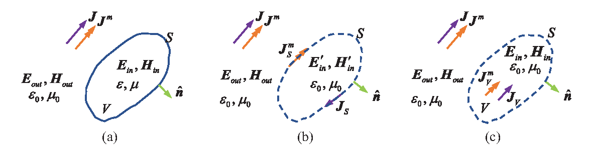

# 基础电磁理论 (Fundamental Electromagnetics)

本章介绍计算电磁学所需的基础理论：麦克斯韦方程组、势函数与规范、格林函数、
场-源积分算子以及等效原理。公式与符号约定均来自论文第 2 章
（时间因子 $e^{j\omega t}$，虚数单位记为 ${\rm j}$）。

## 1. 麦克斯韦方程组 (Maxwell's Equations)

频域下，各向同性、线性、均匀介质中的时谐电磁场满足（论文式 (2-1)）：

$$
\begin{aligned}
\nabla \times \bm{E} &= -{\rm j}\omega \bm{B} - \bm{J}^m \\
\nabla \times \bm{H} &= \bm{J} + {\rm j}\omega \bm{D} \\
\nabla \cdot \bm{D} &= \rho_e \\
\nabla \cdot \bm{B} &= \rho_m
\end{aligned}
$$

本构关系为 $\bm{D} = \varepsilon \bm{E}$、$\bm{B} = \mu \bm{H}$。
其中 $\bm{J}$、$\bm{J}^m$ 分别为外加电流密度与磁流密度（磁流为数学上的等效引入），
$\rho_e$、$\rho_m$ 为对应电荷/磁荷密度。电流与电荷满足连续性方程
$\nabla \cdot \bm{J} = -{\rm j}\omega \rho_e$。

## 2. 势函数与规范 (Potentials and Gauge)

由 $\nabla \cdot \bm{B} = 0$ 引入磁矢势 $\bm{A}$，电场可表示为（论文式 (2-5)）：

$$
\bm{E} = -{\rm j}\omega \bm{A} - \nabla \phi
$$

利用恒等式 $\nabla \times \nabla \times \bm{A} = \nabla(\nabla \cdot \bm{A}) - \nabla^2 \bm{A}$，
可引入洛伦兹规范（论文式 (2-7)）：

$$
\nabla \cdot \bm{A} + {\rm j}\omega\mu\varepsilon \phi = 0
$$

于是 $\bm{A}$、$\phi$ 分别满足非齐次亥姆霍兹方程，其自由空间积分解为：

$$
\bm{A}(\bm{r}) = \mu \int_\Omega G(R)\,\bm{J}(\bm{r}') d\Omega', \qquad
\phi(\bm{r}) = -\frac{1}{{\rm j}\omega\varepsilon} \int_\Omega G(R)\,\nabla' \cdot \bm{J}(\bm{r}') d\Omega'
$$

其中 $\Omega \in \{S, V\}$ 为源所在的面/体区域，$R = |\bm{r} - \bm{r}'|$，
标量格林函数为（论文式 (2-10)）：

$$
G(R) = \frac{e^{-{\rm j}kR}}{4\pi R}, \qquad k = \omega\sqrt{\mu\varepsilon}
$$

将势的解代回 $\bm{E} = -{\rm j}\omega\bm{A} - \nabla\phi$ 并利用洛伦兹规范消去标量势，
场可由磁矢势单独表示（论文式 (2-12)）：

$$
\bm{E}(\bm{r}) = -{\rm j}\omega \bm{A}(\bm{r}) + \frac{\nabla\nabla\cdot \bm{A}(\bm{r})}{{\rm j}\omega\mu\varepsilon}
$$

## 3. 场-源积分算子 (Integral Operators)

引入磁流 $\bm{J}^m$ 后，空间任意点的电磁场可由电流/磁流与格林函数积分表示
（论文式 (2-20)~(2-22)）：

$$
\left\{
\begin{aligned}
\bm{E}(\bm{r}) &= \eta\, \mathcal{L}\left[\bm{J}(\bm{r}')\right] + \mathcal{K}\left[\bm{J}^m(\bm{r}')\right] \\
\bm{H}(\bm{r}) &= \frac{1}{\eta}\, \mathcal{L}\left[\bm{J}^m(\bm{r}')\right] - \mathcal{K}\left[\bm{J}(\bm{r}')\right]
\end{aligned}
\right.
$$

其中 $\eta = \sqrt{\mu/\varepsilon}$ 为波阻抗，矢量算子定义为：

$$
\mathcal{L}\left[\bm{X}(\bm{r}')\right] = -{\rm j}k \left(1 + \frac{1}{k^2}\nabla\nabla\cdot\right) \int_\Omega G(R)\,\bm{X}(\bm{r}') d\Omega'
$$

$$
\mathcal{K}\left[\bm{X}(\bm{r}')\right] = \int_\Omega \bm{X}(\bm{r}') \times \nabla G(R)\, d\Omega'
$$

$\mathcal{L}$ 算子还有两种等价的常用形式（论文式 (2-23)~(2-24)）：

$$
\mathcal{L}[\bm{X}] = -{\rm j}k \int_\Omega \left\{ G(R)\bm{X} + \frac{1}{k^2}\nabla G(R)\left[\nabla' \cdot \bm{X}\right] \right\} d\Omega'
$$

$$
\mathcal{L}[\bm{X}] = -{\rm j}k \int_\Omega \overline{\bm{G}}(R) \cdot \bm{X}\, d\Omega', \qquad
\overline{\bm{G}}(R) = \left(\overline{\bm{I}} + \frac{1}{k^2}\nabla\nabla\right) G(R)
$$

其中 $\overline{\bm{I}}$ 为单位并矢，$\overline{\bm{G}}$ 称为并矢格林函数。

## 4. 等效原理 (Equivalence Principle)

等效原理建立在惠更斯原理与电磁场唯一性定理基础上：用等效源替代复杂结构，
并保证待求解区域中的场分布不变，从而把问题转化为自由空间中的等效源辐射问题。

### 4.1 面等效原理 (Surface Equivalence Principle)

移除散射体并在其表面 $S$ 放置等效面电流与面磁流（论文式 (2-26)）：

$$
\bm{J}_S = \hat{\bm{n}} \times \left(\bm{H}_{out,S} - \bm{H}'_{in,S}\right), \qquad
\bm{J}_S^m = -\hat{\bm{n}} \times \left(\bm{E}_{out,S} - \bm{E}'_{in,S}\right)
$$

其中 $\hat{\bm{n}}$ 为闭合面 $S$ 的外法向量。采用面等效后，散射场完全由等效源
按第 3 节的算子公式产生（论文式 (2-27)）。Love 等效将内部场设为零场，
据此可得到金属散射问题的表面积分方程。

### 4.2 体等效原理 (Volume Equivalence Principle)

对非均匀介质体，将其替换为背景介质（$\varepsilon_0, \mu_0$），并引入体等效源
（论文式 (2-28)）：

$$
\bm{J}_V = {\rm j}\omega (\varepsilon - \varepsilon_0)\bm{E}, \qquad
\bm{J}_V^m = {\rm j}\omega (\mu - \mu_0)\bm{H}
$$

此时空间总场为入射场与体等效源产生的散射场之和：

$$
\bm{E}(\bm{r}) = \bm{E}^i(\bm{r}) + \eta \mathcal{L}[\bm{J}_V] + \mathcal{K}[\bm{J}_V^m]
$$

这就是体积分方程 (VIE) 的物理基础。对于大多数常见材料 $\mu \approx \mu_0$，
体磁流 $\bm{J}_V^m$ 可以忽略。
