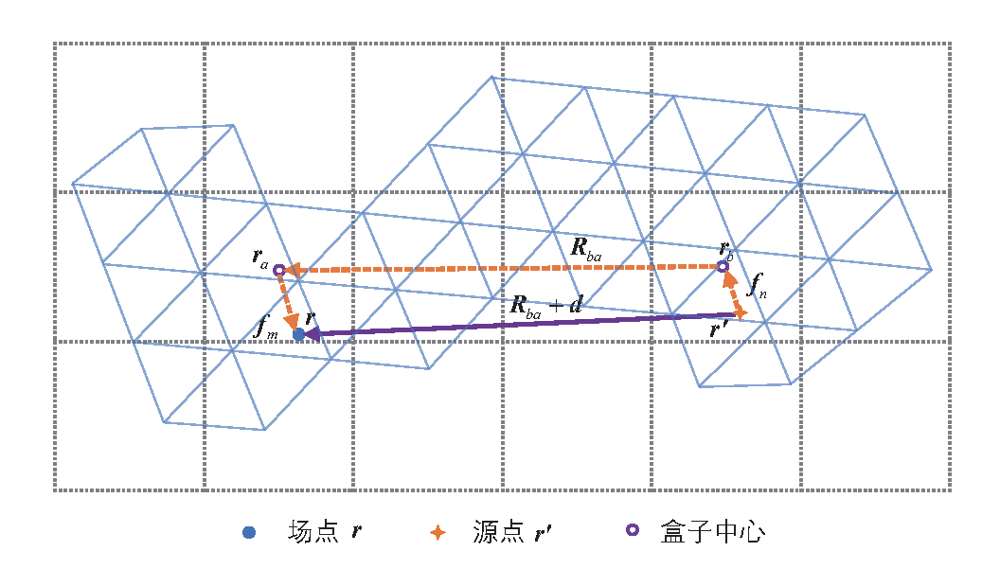
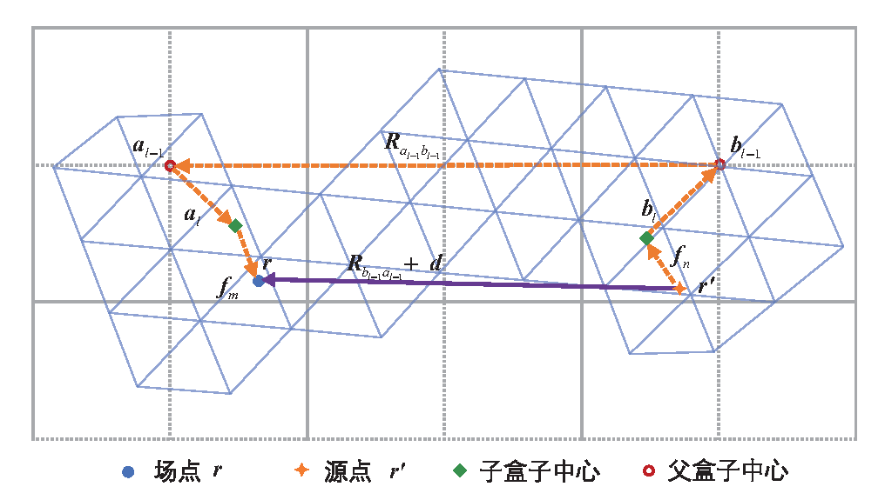
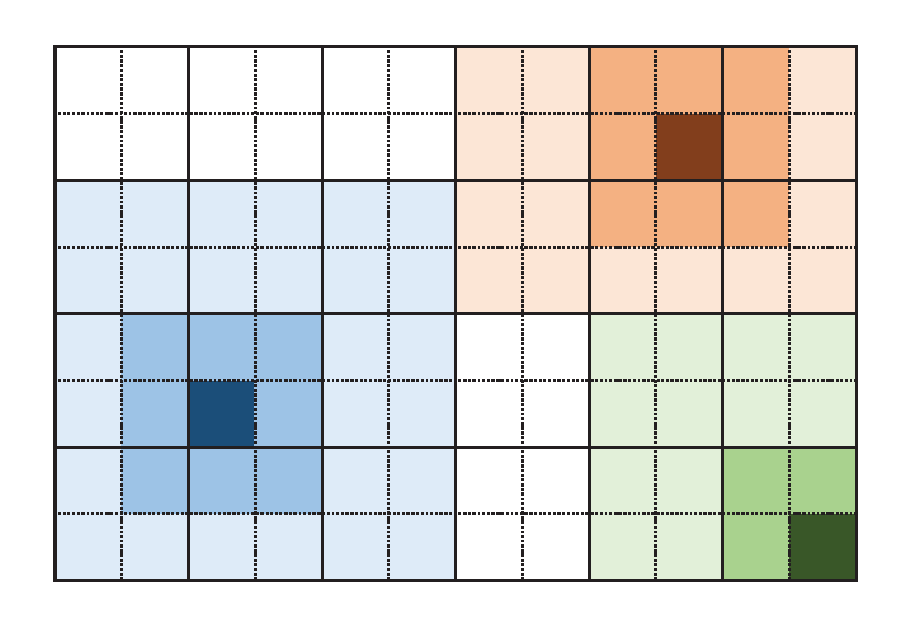
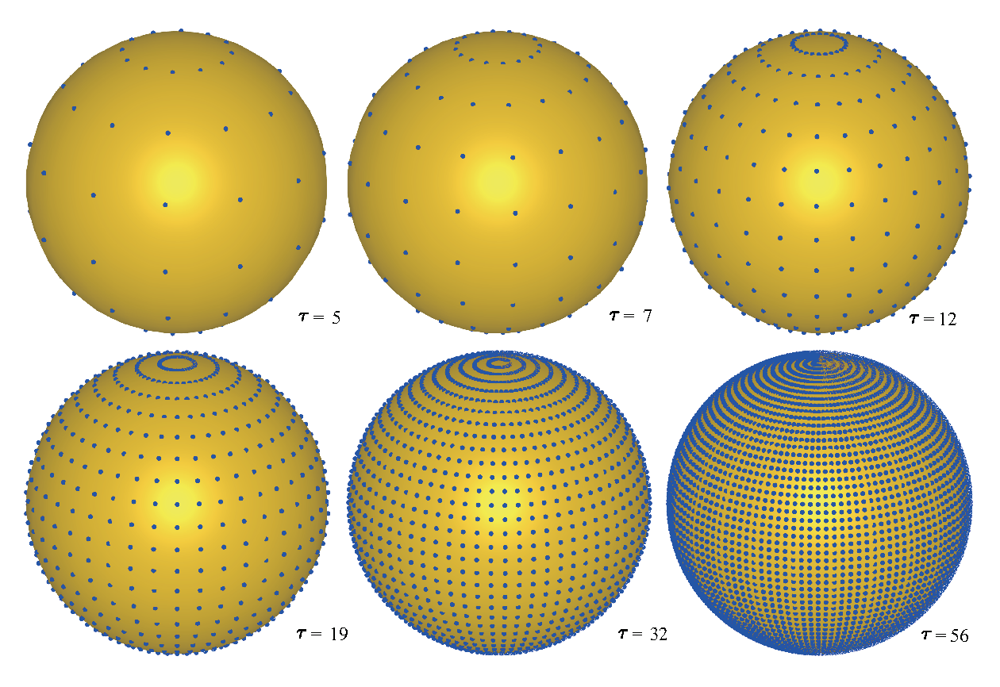
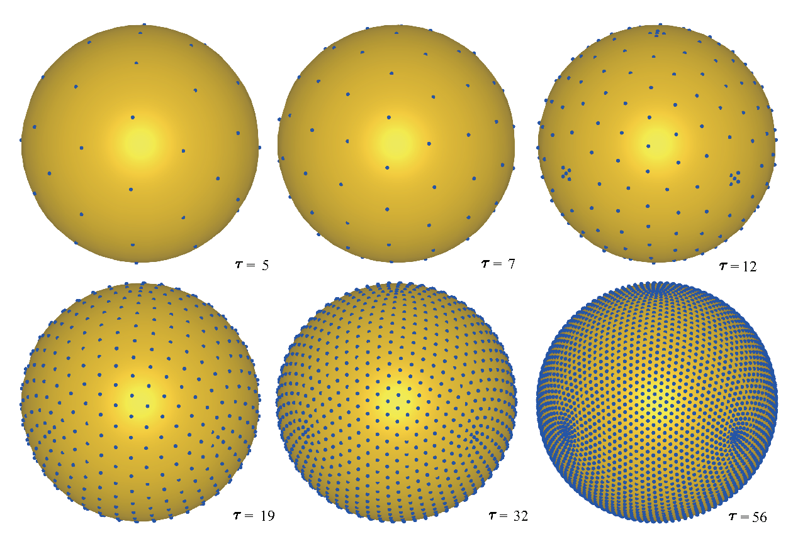
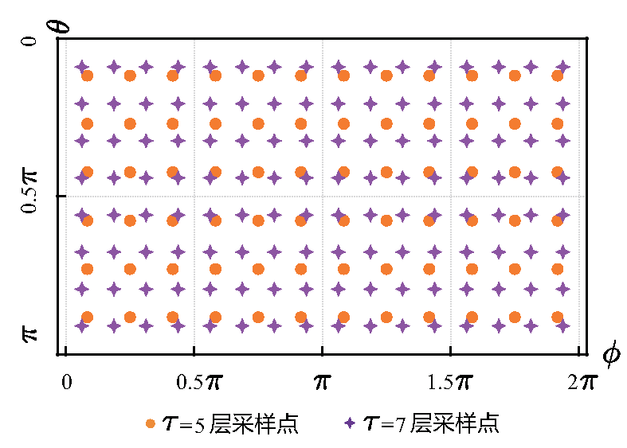
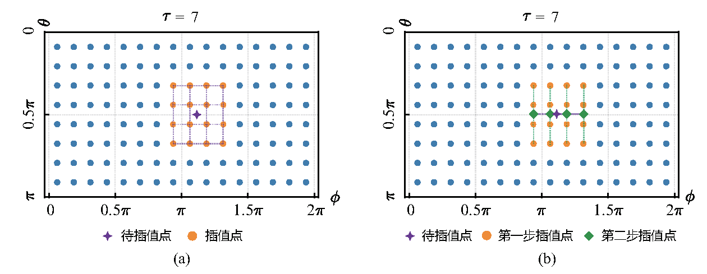
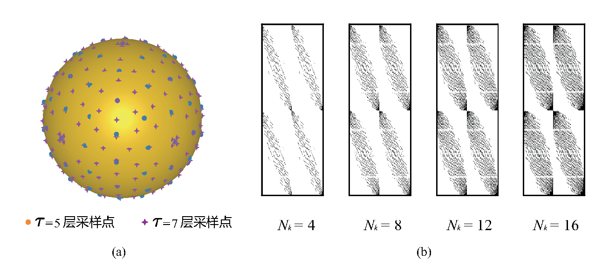
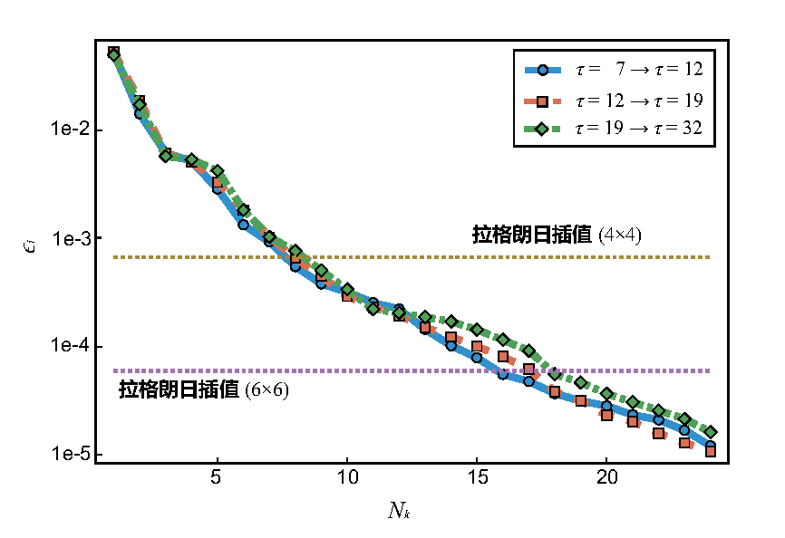
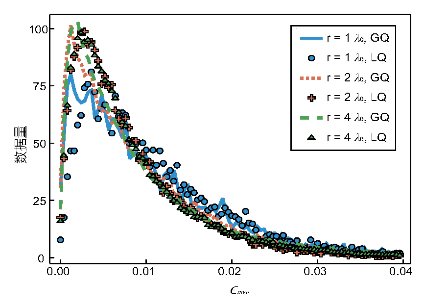

# 快速算法

传统矩量法在显式装配与矩阵向量乘阶段需要 $O(N^2)$ 的时间与存储。对电大尺寸
问题，EMMoMSuite 通过多层快速多极子算法（MLFMA）把远场相互作用的复杂度
降低到接近 $O(N \log N)$，并采用论文第 4 章提出的 Lebedev 求积与球面非规则
矢量插值进一步降低常数因子。

## 1. 多层快速多极子算法

### 1.1 球面波加法定理与转移函数

MLFMA 的核心是对自由空间标量格林函数做球面波展开（论文式 (2-38)~(2-41)）：

$$
\frac{e^{-{\rm j}k|\bm{R} + \bm{d}|}}{4\pi|\bm{R} + \bm{d}|}
= -\frac{{\rm j}k}{4\pi} \sum_{l=0}^{\infty} (-{\rm j})^{2l} (2l+1)
j_l(kd)\, h_l^{(2)}(kR)\, P_l(\hat{\bm{d}} \cdot \hat{\bm{R}})
$$

其中 $j_l$ 为第一类球贝塞尔函数，$h_l^{(2)}$ 为第二类球汉克尔函数，
$P_l$ 为勒让德多项式。对 $(-{\rm j})^l j_l(kd) P_l$ 做平面波展开：

$$
(-{\rm j})^l j_l(kd) P_l(\hat{\bm{d}} \cdot \hat{\bm{R}})
= \frac{1}{4\pi} \int_\Omega e^{-{\rm j}k\hat{\bm{k}} \cdot \bm{d}}
P_l(\hat{\bm{k}} \cdot \hat{\bm{R}})\, d^2\hat{\bm{k}}
$$

于是带偏置的格林函数可写成单位球面上的积分，其中**转移函数**为
（论文式 (2-41)）：

$$
T_\tau(k, \hat{\bm{k}}, \bm{R}) =
\frac{-{\rm j}k}{(4\pi)^2} \sum_{l=0}^{\tau} (-{\rm j})^l (2l+1)
h_l^{(2)}(kR)\, P_l(\hat{\bm{k}} \cdot \hat{\bm{R}})
$$

当源点、场点各自在盒子中心附近变化时转移函数保持不变，据此可加速矩阵向量乘。
球面积分近似为加权求和（论文式 (2-43)）：

$$
\int_\Omega f(\hat{\bm{k}})\, d^2\hat{\bm{k}} \approx \sum_{p=1}^{N_p} W_p f(\hat{\bm{k}}_p), \qquad
\sum_{p=1}^{N_p} W_p = 4\pi
$$

### 1.2 远场矩阵向量乘积

以面 EFIE 为例，远场部分（论文式 (2-45)~(2-49)）：

$$
b_m = {\rm j}k\eta \int_\Omega
\bm{\mathcal{R}}_S(\bm{f}_m^S, \hat{\bm{k}}) \cdot
T_\tau(k, \hat{\bm{k}}, \bm{R}_{ba})
\sum_{n=1}^{N} x_n \bm{\mathcal{F}}_S(\bm{f}_n^S, \hat{\bm{k}})\, d^2\hat{\bm{k}}
$$

其中辐射/配置积分算子为：

$$
\bm{\mathcal{R}}_S(\bm{f}_m^S, \hat{\bm{k}}) = \int_{S_m}
\left(\overline{\bm{I}} - \hat{\bm{k}}\hat{\bm{k}}\right) \cdot \bm{f}_m^S(\bm{r})\,
e^{-{\rm j}k\hat{\bm{k}}\cdot(\bm{r} - \bm{r}_a)}\, dS
$$

$$
\bm{\mathcal{F}}_S(\bm{f}_n^S, \hat{\bm{k}}) = \int_{S_n}
\left(\overline{\bm{I}} - \hat{\bm{k}}\hat{\bm{k}}\right) \cdot \bm{f}_n^S(\bm{r}')\,
e^{-{\rm j}k\hat{\bm{k}}\cdot(\bm{r}_b - \bm{r}')}\, dS'
$$

在球坐标下 $\overline{\bm{I}} - \hat{\bm{k}}\hat{\bm{k}} = \mathrm{diag}(0,1,1)$，
即只保留 $\theta$、$\phi$ 切向分量。多层形式把 $\bm{r} - \bm{r}'$ 逐层拆分，
聚合（upward）、转移（translation）、配置（downward）三阶段独立复用。

### 1.3 截断项经验公式

转移函数截断项数按盒子尺寸选取（论文式 (2-42)）：

$$
\tau(l) \approx 1.73\, k a_l + 2.16\, d_0^{2/3} (k a_l)^{1/3}, \qquad d_0 = 3
$$

其中 $a_l$ 为第 $l$ 层盒子边长，$d_0$ 为精度位数。代码中
`truncation_kernel(rel_l)` 传入 $rel_l = a_l/\lambda$，等价地写为
$2\pi\sqrt{3}\, rel_l + 2.16\, d_0^{2/3} (2\pi\, rel_l)^{1/3}$
（注意 $1.73 \cdot 2\pi \approx 2\pi\sqrt{3}$；实现中的精度参数取 9，得到的
截断更保守）。

### 1.4 层间插值与反插值

各层转移函数阶数不同，所需球面采样率也不同，因此聚合/配置时需要在层间
匹配采样点（论文式 (4-2)~(4-3)）：

$$
\bm{\mathcal{F}}(\hat{\bm{k}}^{l-1}) = \bm{\Gamma}^{l-1,l} \bm{\mathcal{F}}(\hat{\bm{k}}^{l})
$$

其中 $\bm{\Gamma}^{l-1,l}$ 为第 $l$ 层到父层第 $l-1$ 层的插值矩阵。
**反插值不是下采样**，而是由"同层两种采样率下转移结果相等"推导得到的
伴随关系：转移并乘上求积权重后，左乘插值矩阵的转置即可完成向子层的配置
（论文式 (4-8)~(4-13)）：

$$
\left(\bm{\Gamma}^{l-1,l}\right)^T \bm{\mathcal{T}}(\hat{\bm{k}}^{l-1})
= \bm{\mathcal{T}}(\hat{\bm{k}}^{l})
$$

### 1.5 算法流程

1. 八叉树划分：叶层盒子边长一般取 $0.20\lambda \sim 0.25\lambda$，盒子边长
   $a_0 = 2^i a_f$ 逐层倍增（`OctreeBuilder.build_octree`）。

   

2. 计算近场矩阵（CSR/CSC，叶层 + 邻盒子），远场封装为算子。
3. 远场算子：聚合（叶层辐射积分 + 逐层插值/相移）、转移（同层远亲盒子）、
   配置（反插值/相移 + 叶层测试）。
4. 完整矩阵向量乘积 $Zx = Z_{near} x + Z_{far}(x)$。

## 2. Lebedev 求积与球面非规则矢量插值

### 2.1 为什么用 Lebedev

球面高斯求积把球面展开为 $\theta \in [0,\pi]$、$\phi \in [0,2\pi]$ 的矩形区域，
$\theta$ 方向取 $\tau+1$ 个 Gauss-Legendre 点、$\phi$ 方向均匀取
$2(\tau+1)$ 个点，共 $2(\tau+1)^2$ 个点（求积效率仅 $2/3$，两极附近冗余）。
Lebedev 求积把单位球面按直角坐标划分为 8 个旋转对称区域并求解非线性方程组，
得到更均匀的点分布，求积效率接近 1，点数约为球面高斯的 $2/3$。

### 2.2 球面高斯求积与拉格朗日局部插值

球面高斯求积的采样点落在 $\theta$、$\phi$ 的规则格点上，两层之间可以方便地
做拉格朗日局部插值：以待插值点附近 $N_{ip} \times N_{ip}$ 个采样点为支撑构造
插值多项式（论文式 (4-4)~(4-7)），插值矩阵与函数值无关、可在预处理阶段计算，
且保持稀疏。

单步插值每行有 $N_{ip}^2$ 个非零元，完成一次插值的计算量为
$N_p^{l-1} N_{ip}^2$；分步插值先在 $\theta$ 方向一维插值得到中间态、再沿
$\phi$ 方向插值，计算量降为 $\left(N_p^{l-1} + N_{p,\theta}^{l-1}\right) N_{ip}$，
且中间态可被多个待插值点复用。反插值使用插值矩阵的转置（分步插值则两步转置
后调换顺序，论文 4.1.4 节）。

### 2.3 球面非规则矢量插值

Lebedev 点不在规则网格上，且 $\theta$、$\phi$ 展开极不均匀，不能按标量分量
分别插值。论文规定：极点处（$\theta = 0, \pi$）切向矢量取直角坐标 $x, y$
（$\theta=\pi$ 取 $x, -y$）分量，其余位置取 $\theta$、$\phi$ 分量；把两分量
拼接为列向量后，层间插值写成 $2N_p^{l-1} \times 2N_p^l$ 的分块形式
（论文式 (4-20)）：

$$
\begin{bmatrix}
\bm{\mathcal{F}}_\theta(\hat{\bm{k}}^{l-1}) \\
\bm{\mathcal{F}}_\phi(\hat{\bm{k}}^{l-1})
\end{bmatrix}
=
\begin{bmatrix}
\bm{\Gamma}_{\theta\theta}^{l-1,l} & \bm{\Gamma}_{\theta\phi}^{l-1,l} \\
\bm{\Gamma}_{\phi\theta}^{l-1,l} & \bm{\Gamma}_{\phi\phi}^{l-1,l}
\end{bmatrix}
\begin{bmatrix}
\bm{\mathcal{F}}_\theta(\hat{\bm{k}}^{l}) \\
\bm{\mathcal{F}}_\phi(\hat{\bm{k}}^{l})
\end{bmatrix}
$$

其中交叉块 $\bm{\Gamma}_{\theta\phi}$、$\bm{\Gamma}_{\phi\theta}$ 连接了两个
分量的信息，使插值成为矢量插值而非分量独立插值。反插值仍为插值矩阵的转置。

### 2.4 插值矩阵计算

**辐射函数数据集**。各类基函数的辐射积分可归纳为通用形式（论文式 (4-21)）：

$$
\bm{\mathcal{F}}(\hat{\bm{k}}) = C_f \left(\overline{\bm{I}} - \hat{\bm{k}}\hat{\bm{k}}\right)
\cdot \bm{\hat{\rho}}\, e^{-{\rm j}k\hat{\bm{k}} \cdot (\bm{r}_b - \bm{r}')}
$$

随机生成 $\bm{\hat{\rho}}$ 与尺度在盒子大小的 $\bm{r}_b - \bm{r}'$，在同一辐射源
的两层采样点上批量计算（实部、虚部分别作为数据列，数据集翻倍），得到
$\bm{\mathbbm{F}}(\hat{\bm{k}}^{l-1})$ 与 $\bm{\mathbbm{F}}(\hat{\bm{k}}^{l})$。

**矩阵初始化（稀疏模式）**。对每个父层待插值点，选距离最近的 $N_k$ 个子层
采样点作为插值点（4 个子块同步标记），其余位置为零，保证矩阵高度稀疏。
采样点按直角坐标 $x$、$y$、$z$ 值排序（满足 $\hat{\bm{k}}_i = -\hat{\bm{k}}_{N_p^l+1-i}$），
不同阶数的 Lebedev 点之间共享 14 个固定点（6 个轴点 $\pm\hat{x}, \pm\hat{y}, \pm\hat{z}$
与 8 个立方体角点 $(\pm\sqrt{3}/3, \pm\sqrt{3}/3, \pm\sqrt{3}/3)$），
这些点不需要插值，对应行只有 1 个非零元"1"。

**伪逆法（逐行）**。完整求解 $\bm{\Gamma}^{l-1,l} = \bm{\mathbbm{F}}(\hat{\bm{k}}^{l-1})\bm{\mathbbm{F}}^{\dagger}(\hat{\bm{k}}^{l})$
得到的是稠密矩阵。论文改为逐行计算
（论文式 (4-24)~(4-26)）：对第 $p$ 行，提取非零元 $\bm{\gamma}_p$ 与列索引
集合 $C_p$（$2N_k$ 个，两个子矩阵的行），求解

$$
\bm{\gamma}_p = \bm{\mathbbm{F}}_p(\hat{\bm{k}}^{l-1})\,
\bm{\mathbbm{F}}_{C_p}^{\dagger}(\hat{\bm{k}}^{l})
$$

行满秩条件由 $N_d > 2N_{pl}$ 降为 $N_d > 2N_k$，数据集规模只需匹配插值点数。
EMMoMSuite 中 `pinv2interpW.jl` 即按此实现（先反距离权重初始化稀疏模式，
再逐行 `pinv` 求解）；同时提供 `SHInterp.jl` 的球谐精确/局部/混合解析权重
作为确定性的替代路径。

**神经网络训练**（论文式 (4-27)~(4-29)）。把插值问题化为损失函数
$\mathrm{Loss}(\bm{\Gamma}) = \|\bm{\Gamma}\bm{\mathcal{F}}(\hat{\bm{k}}^{l}) - \bm{\mathcal{F}}(\hat{\bm{k}}^{l-1})\|^{\mathcal{P}}$
的最小化，用梯度下降
（论文采用 Nesterov 加速法）更新稀疏插值矩阵。训练收敛结果与伪逆法基本一致，
实际计算 CPU 资源充足时推荐伪逆法。

### 2.5 精度与效率

- 插值误差定义（论文式 (4-30)）：
  $\epsilon_i = |\tilde{\bm{\mathcal{F}}} - \bm{\mathcal{F}}| / \max|\bm{\mathcal{F}}|$。
- 拉格朗日插值 $4\times4$、$6\times6$ 窗口的平均误差约为 $6\times10^{-4}$、
  $6\times10^{-5}$；Lebedev 矢量插值用 8 个、18 个插值点达到同等精度。

- 相同精度下单点计算量与拉格朗日单步插值一致；Lebedev 采样点约为球面高斯的
  $2/3$，总体时间、空间复杂度降低约 $1/3$。论文算例中叶层插值点数取 9、
  其余层取 8。

### 2.6 高阶层的实现策略

Lebedev 数据集最高支持 131 阶多项式（论文给出 131 阶的数据集）。当某层的
多项式阶数 $p = 2\tau+1$ 超过数据集上限时，`LebedevSortedPoints.high_order_nodes`
采用 Fibonacci 准均匀格点（等权重 $4\pi/n$）作为替代，保证任意高阶都能构造
求积点；`LVI.jl` 的 `levelIntegralInfoCal` 会对此发出警告。

## 3. 低频 MLFMA 与 ACA

标准平面波形式的 MLFMA 在低频下会出现 low-frequency breakdown（展开形式随
盒尺寸与波数缩小而病态）。常见解决路线包括低频稳定的多极子展开形式、
归一化平面波展开或低频重标定。

自适应交叉近似（ACA）是核无关的代数压缩方法，对远场块 $\bm{Z}_{block}$ 构造
$\bm{Z}_{block} \approx \bm{U}\bm{V}^{T}$（$\bm{U} \in \mathbb{C}^{M\times r}$，
$\bm{V} \in \mathbb{C}^{N\times r}$，$r \ll M, N$），不依赖核函数的解析加法定理，
对复杂介质核更灵活，但常数因子与稳定性需要单独评估。
